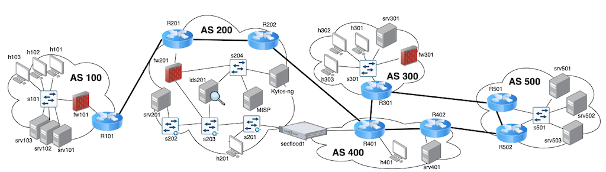

# Roteiro de Laboratório - Execução, detecção e contenção de ataques de varredura de portas, brute-force e negação de serviço

Neste laboratório vamos simular um cenário típico de ataques de varredura de portas (scan), ataques para quebra do mecanismo de autenticação (brute-force) e ataques de negação de serviço simples (DoS). Os ataques ocorrerão em um topologia conforme ilustrado na Figura 1.

*Figura 1: Topologia de Rede do Laboratório*

## Atividade 1 - Acesso aos nós e teste de conectividade

TODO

## Atividade 2 - Ataques de varredura de porta

TODO

## Atividade 3 - Ataques de brute-force

TODO

## Atividade 4 - Ataques de negação de serviço

TODO

## Atividade 5 - Detecção e contenção de ataques de varredura

TODO
